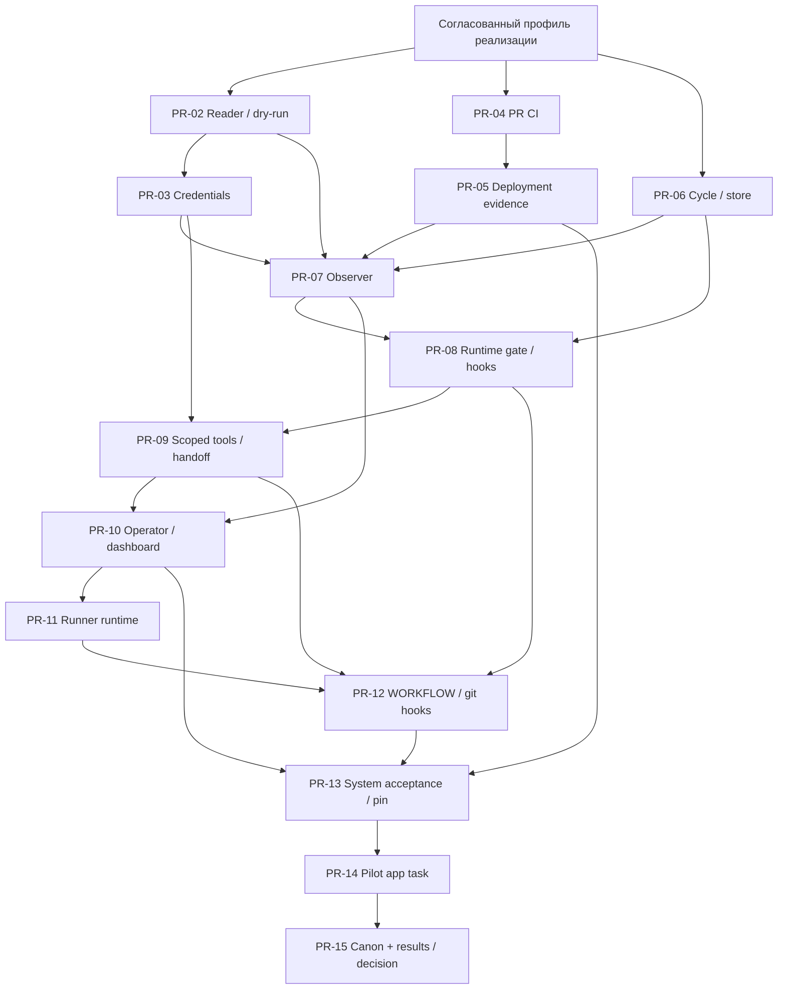

# План PR: Symphony и agent-runner для EmotionStat Delivery

**Подключение deployment evidence (PR-05 и последующие этапы):** инструкции controller, дашборда и приёмки запуска перенесены в [отдельный документ Symphony](github_projects_setup/deployment-evidence-integration.md). Текущая рабочая папка — `D:/symphony`; `D:/fork/_symphony/symphony` в более ранних записях ниже — прежнее расположение. Контракт отчёта и эксплуатация deployment workflow остаются в `EmotionStat/app`.

Обновлено: 2026-09-16. **PR-02–PR-06 реализованы; PR-07 подготовлен локально** в `agent/feat/github-delivery-observer` от `main` (`56b4fbb`). PR-04/PR-05 приняты в приложении: текущий deployment и evidence проверены через GitHub App. `make all` PR-07 и read-only приёмка пройдены. Push и merge PR-07 выполняет владелица. PR-01 отложен; PR-08–PR-15 и пилот ещё предстоят. Идентификаторы этапов не совпадают с номерами GitHub PR; исторические записи ниже сохраняют состояние на свою дату.

**Изменение очередности по решению владелицы 2026-09-15:** сейчас knowledge-base не изменяем. PR-01 отложен, его объём объединяется с итоговым PR-15 после реализации и проверки пилота либо фиксации его остановки. Первый этап реализации — PR-02 в выбранном форке Symphony; ожидать PR-01 не требуется. Нумерация этапов сохранена для существующих ссылок. Новые решения, вопросы и результаты проверок записываются в этих двух планах и документации соответствующих кодовых PR; подтверждённые итоги затем переносятся в базу знаний одним согласованным обновлением. Обязательная документация поведения/config в Symphony и agent-runner обновляется вместе с кодом.

Технический контракт описан в [плане адаптера](github_projects_adapter_plan.md). Этот документ задаёт границы изменений, зависимости, доказательства готовности и операторские шаги. Интерактивная панель — [макет](github_projects_ui/recovery-interface-preview.html); рядом сохранены [desktop](github_projects_ui/manual-validation-desktop.png) и [mobile](github_projects_ui/manual-validation-mobile.png) изображения. Чтение Project и конечная инспекция реализованы в PR-02. Серверные операции панели и исполнение задач новым runtime пока не реализованы.

## 1. Что уже известно и что остаётся pending

| Вопрос | Состояние на дату плана | Следствие |
| --- | --- | --- |
| Symphony | `D:/symphony`, PR-07 в `agent/feat/github-delivery-observer` от `main` (`56b4fbb`) | Все дальнейшие изменения Symphony выполнять здесь; PR направлять в личный fork с базой `main` |
| agent-runner | `D:/agent-runner`, default branch `main` | Служебные PR направляются в `main` |
| Knowledge-base | `D:/work/EmotionStat/knowledge-base`, default branch `main` | Изменения отложены; согласованные итоги реализации и пилота объединяются в PR-15 в `main` |
| Приложение | `D:/EmotionStat_app/app`, локальная ветка `dev` | Все предлагаемые app PR направляются в `dev`; default branch проверить через GitHub |
| Delivery | Организация `EmotionStat`, Project `1`, рабочий repo только `EmotionStat/app` | Private API IDs, типы полей, права и автоматизации проверить read-only |
| Проверки приложения | PR-04 добавил PR CI до merge; deployment повторяет verify для `dev`. PR-05 публикует evidence | Автоматических post-deploy smoke tests пока нет; dev validation ручная |
| Runtime | **WSL2 выбран; создан отдельный distro `Ubuntu-26.04` для worker** | В новом distro отключены Windows automount/interop, проверен вход под uid 2002. В новом distro проверен rootless Podman 5.7.0. Codex и SSH пока проверены только в прежнем `Ubuntu`; контейнер worker и финальная изоляция O2 ещё не настроены |
| Fork Symphony | **Подтверждён:** [nataliastaselko8-spec/symphony](https://github.com/nataliastaselko8-spec/symphony), публичный fork `openai/symphony`, default branch `main` | `origin` и default push remote — личный fork; `upstream` — `openai/symphony`. Symphony PR направляются в fork с базой `main`. Права публикации проверены: ветка и draft PR #1 опубликованы в личном форке; upstream не изменён |
| GitHub identity | **Подтверждено владельцем: отдельное GitHub App, принадлежащее EmotionStat** | PR-03 реализует обновление installation tokens на controller. O3a подтверждён через GitHub API 2026-09-15: App принадлежит EmotionStat, установка активна, repository_selection=selected, запрошенные права выданы. Ключ установлен вне repo в защищённой папке controller. O3b подтверждён конечной read-only inspection: токен ограничен EmotionStat/app, Project Delivery прочитан без ошибок. Полный список остальных repo установки этим суженным токеном не проверяется. Service PAT в выбранный профиль не входит |
| Оператор | **Подтверждено: владелица проекта сама выполняет роль единственного оператора** | Она проверяет и сливает PR, вручную проверяет dev и записывает результат, разрешает и назначает recovery. PR-10 настраивает её отдельный operator principal; полномочия GitHub и доступ к панели проверяются до пилота |

В knowledge-base уже есть три согласованные, но не закоммиченные правки от 2026-09-14: `Agent Development Workflow.md`, `GitHub Cloudflare Deployment Setup Plan.md` и строка OPS-002 в `Action Register.md`. Сейчас эти файлы оставляем в существующем состоянии; при итоговом PR-15 сохранить смысл этих правок и отделить посторонние изменения. В app есть посторонний untracked `apps/web/src/shared/telemetry/README.md`: не включать его в эту серию автоматически.

Имена новых файлов ниже — предложения. Перед реализацией каждого PR проверить текущие `AGENTS.md`, дерево репозитория и полный diff. Ответы владельца могут уточнить профиль и зависимости; отсутствие ответа не является согласием на вариант.

### Подготовка WSL2: фактический статус на 2026-09-15

По выводу команд, выполненных владельцем: WSL 2.7.14.0, исходный distro `Ubuntu` — Ubuntu 26.04 LTS x86_64, PID 1 — systemd. В нём у controller-пользователя `nataselko` проверены Elixir 1.19.5 и OTP 28 через mise. У прежнего `symphony-worker` (uid 1002, без групп sudo/docker) установлены Codex CLI 0.154.0 с входом через ChatGPT, uv 0.11.32 и Python 3.11.15; доступны Git 2.53.0, Node 24.15.0 и npm 11.12.1. Эти инструменты и авторизация относятся только к исходному distro. При реализации PR-02 полная сборка и make all Symphony успешно выполнены в исходном Ubuntu под controller nataselko; проверки приложения и рабочего контейнера этим не подтверждаются.

В исходном `Ubuntu` SSH проверен на `127.0.0.1:2222`, только publickey/worker, без forwarding и PTY. Controller использует `~/.ssh/symphony_config`, alias `symphony-worker-local`, отдельные identity/known_hosts; публичный ключ разрешён через root-owned `/etc/ssh/symphony-authorized-keys/symphony-worker`. Неинтерактивный `bash -lc` через SSH видит worker Codex/auth/uv/Python.

Проверка прежнего worker uid 1002 в исходном `Ubuntu` показала `CONTROLLER_KEY_BLOCKED`, `WINDOWS_HOME_WRITABLE`, `DOCKER_SOCKET_NOT_WRITABLE` и включённый `WSLInterop`. Проверка одного Docker socket не исключает другие host endpoints; `test -r` на Linux-ключе не исключает обход через Windows. Владелец подтвердил, что исходная Ubuntu используется и для других задач; её настройки, Docker Desktop и глобальный WSL не изменяем для изоляции worker.

Создан отдельный WSL2 distro **`Ubuntu-26.04`**; в команде установки выбран каталог `D:/WSL/SymphonyWorker`. В его `/etc/wsl.conf` сохранён `systemd=true`, установлены `automount.enabled=false`, `automount.mountFsTab=false`, `interop.enabled=false`, `interop.appendWindowsPath=false`. После перезапуска только этого distro Windows-диски не найдены среди mounts, `WSL_INTEROP` не задан, entry `WSLInterop` отсутствует; остаётся системный `/usr/lib/wsl/drivers` типа 9p. Создан `symphony-worker` uid/gid 2002, без sudo/docker; `[user] default=symphony-worker` и настройка OOBE обеспечили проверенный обычный вход под этим пользователем. Прежний worker uid 1002 и его авторизация остаются в исходном `Ubuntu`.

**O2 не готов к исполнению задач:** в новом distro остаются общие пути `/mnt/wsl`, `/mnt/wslg`, `/run/WSL` и `/tmp/.X11-unix`; отдельный distro сам по себе не доказывает изоляцию. Следующий предложенный слой — rootless Podman внутри нового distro, с отдельными mount/PID/IPC/network namespaces и только явно разрешёнными volumes. В новом distro установлен Podman 5.7.0; под worker uid 2002 получен `rootless=true`. В `/etc/subuid` и `/etc/subgid` выделен диапазон `100000:65536`, `podman unshare` подтвердил отображения `0 → 2002` (1 ID) и `1 → 100000` (65536 IDs) для UID/GID. Получено предупреждение о том, что mount `/` не имеет режима shared; режим монтирования не изменён. Первый временный контейнер `docker.io/library/ubuntu:26.04` успешно скачан и запущен с `--network=none`, `--read-only`, `--cap-drop=all`, `--security-opt=no-new-privileges`, `--user=2002:2002`; получены UID 2002 внутри контейнера и `CONTAINER_START_OK`. Следующая проверка этого временного контейнера подтвердила разные host/container mnt/PID/IPC/net namespace IDs, `NOT_VISIBLE` для перечисленных Windows/WSL/controller/socket путей, `CapEff=0`, `NoNewPrivs=1`, `Seccomp=2`. Это относится к тесту без сети и volumes; рабочий контейнер, новый SSH endpoint и worker tooling/auth ещё не настроены.

На подготовительном этапе в root-сессии нового distro подтверждены cgroup v2 и `nft`; до проб список таблиц был пуст. Проверка `nft --check` с выражением `socket cgroupv2 level 1 "init.scope" counter` завершилась `No such file or directory`, правила не применены. В [официальной конфигурации ядра WSL 6.18.33.2](https://github.com/microsoft/WSL2-Linux-Kernel/blob/linux-msft-wsl-6.18.33.2/arch/x86/configs/config-wsl) `CONFIG_NFT_SOCKET` отключён, что соответствует сбою. Нативный nft socket/cgroup вариант пока непригоден. На машине владельца найдены `xt_cgroup.ko` и `nft_compat.ko`, установлен пакет iptables; `iptables-nft`/`ip6tables-nft` сообщают версию 1.8.11 (`nf_tables`), справка подтверждает `--path` для cgroup2. Владелец выполнил [локальный функциональный тест](github_projects_setup/check_worker_cgroup_network.py) и получил `SUMMARY PASS`: до правил TCP-соединения с loopback listener работали внутри и вне отдельной тестовой cgroup; с правилами — `REFUSED` внутри и `CONNECTED` вне неё, под тем же worker UID; после удаления — `CONNECTED` внутри. Это отдельно подтверждено для IPv4 и IPv6. Успешно завершена очистка собственных временных правил и systemd units. Результат доказывает работоспособность cgroup-фильтра в этом окружении, но ещё не сетевую изоляцию настоящего Podman/pasta/SSH/Codex runtime. В рамках PR-11 предстоит проверить размещение сетевого процесса pasta и остальных процессов рабочего контейнера в контролируемой группе, затем проверить ограничения на реальном профиле запуска. Под worker uid 2002 дополнительно подтверждены `XDG_RUNTIME_DIR=/run/user/2002`, текущий `cgroup_manager=systemd`, `runroot=/run/user/2002/containers` и pasta `0.0~git20260120.386b5f5-1`; это сведения о среде, не проверка сетевых ограничений контейнера. Постоянные рабочие сетевые правила не созданы. Образ, профиль запуска и проверки границы относятся к PR-11. До подтверждённой изоляции запуск agent/hooks для задач запрещён.

**Граница подготовки и разработки:** завершённая изоляция O2 не является условием начала PR-02–PR-10. Их разработка, сборка и тесты выполняются в среде разработчика с соблюдением собственных зависимостей каждого PR; подготовка controller для сборки и тестов решается по необходимости. Дополнительные проверки реального worker относятся к PR-11 и приёмке PR-13: (1) размещение процессов и сетевые ограничения Podman/pasta, (2) рабочий образ, volumes, tooling/auth и SSH, (3) совместная работа controller/worker и сохранение ограничений после рестарта. Это три группы приёмки, а не обещание фиксированного числа диагностических команд. Все они обязательны до исполнения первой живой задачи в PR-14, но не блокируют начало рефакторинга.

## 2. Общие инварианты серии

- Одна обычная задача исполняется только по существующей открытой issue из `EmotionStat/app`, связанной с Project 1, при `Ready for agent` и явном `Agent allowed=yes`. `Agent working` используется для проверенного продолжения владельца цикла.
- Один экземпляр controller, один Codex worker одновременно и один незавершённый цикл repo. Цикл продолжается через PR, review, ручной merge, deployment и ручную проверку актуального dev.
- Новая app-задача получает отдельную `agent/...` ветку от свежего `origin/dev`; push — только в свою ветку с явным refspec, PR — строго в `dev`. Служебные изменения Symphony, agent-runner и KB имеют base `main`. Везде изменения проходят через PR; прямой push в `dev`/`main`, автоматический merge и production rollout не входят в серию.
- Retry и возврат из review сохраняют ветку и открытый PR задачи. После merged/closed PR новая разрешённая попытка получает новую ветку. Восстановление не делает reset и не теряет сохранённые коммиты.
- `dispatchable` отражает допуск карточки; занятость repo, состояние deployment и разрешение новой работы проверяются отдельным gate. Пауза уже работающей задачи реализуется явно.
- В MVP `validation.mode=manual`. Успешный run и finalizers необходимы, но недостаточны: оператор фиксирует проверку приложения/сценария и требуемого состояния Scheduler/Queue.
- Подтверждение связано с repo/dev SHA, cycle ID/version, workflow run/attempt, серверными actor/time, result и evidence. Stale/unknown состояние не принимается; отрицательный результат не создаёт и не назначает issue автоматически.
- Recovery назначается явно существующей подходящей карточке. Оно может публиковать исправление сломанного dev. Если основной PR ещё не merged, после восстановления продолжается основной владелец A, а не задача B.
- Состояние цикла хранится на controller вне workspace: versioned JSON, атомарная замена, single writer, резервная копия и явная миграция версии/scope. Потеря файла, рестарт и `Done` cleanup не открывают очередь.
- GitHub API/controller credentials, signing secret, operator credential и state доступны только controller. Worker работает под отдельной OS account через существующий SSH-контракт. Для WSL2 отдельной учётной записи недостаточно: граница исполнения также закрывает доступ к Windows через mounts/interop и к общим host/Docker/WSLg endpoints. Отсутствие доступа проверяется в фактическом контексте запуска, включая hooks и дочерние процессы. Git-доступ worker — отдельный короткоживущий repo-scoped Contents credential без Projects/Actions-write/operator прав либо controller push broker; controller installation token worker не получает.
- Тесты и документация изменения входят в свой PR. PR-13 проверяет всю систему и упаковку, а не закрывает оставленный ранее долг по тестам.
- Read-only означает отсутствие предметных mutations Project/issue/PR/deployment и изменений рабочего/store состояния. GraphQL queries могут использовать HTTP POST; PR-03 также допускает изолированную выдачу read-scoped installation token на controller без scheduler/agent/hooks/store. Первый reader PR-02 использует заранее выданный read token.

## 3. Операторские шаги: не путать с PR

| Шаг | Кто и что делает | Когда и какое доказательство нужно |
| --- | --- | --- |
| O0 — решения | **Все четыре решения подтверждены:** WSL2 на этом компьютере, отдельное GitHub App для EmotionStat, владелица проекта как единственный оператор и fork `nataliastaselko8-spec/symphony` | Выбор решений завершён. Готовность WSL2, созданная App installation, настроенный доступ оператора и разрешение запуска серии проверяются отдельно |
| O1 — fork/remotes | **Выполнено:** выбранный fork подключён к `D:/fork/_symphony/symphony`, сохранены планы/UI, origin/upstream/default push remote проверены | Права публикации подтверждены push ветки PR-02 и созданием [draft PR #1](https://github.com/nataliastaselko8-spec/symphony/pull/1) в личный fork → main. Upstream не изменён |
| O2 — controller/worker | **В процессе:** создан отдельный `Ubuntu-26.04`, отключены Windows mounts/interop, проверен вход uid 2002 | Прежние инструменты/auth/SSH находятся в исходном `Ubuntu`. В новом distro установлен Podman 5.7.0, проверены rootless/UID mappings, запуск временного контейнера без сети и базовые namespace/path/process ограничения. Native nft socket/cgroup dry-run не прошёл; совместимый `iptables-nft -m cgroup --path` прошёл локальный IPv4/IPv6 тест с восстановлением и очисткой. Применимость к реальному Podman/pasta runtime ещё не проверена. Рабочие volumes, сеть, SSH и проверки PR-11 ещё не выполнены. Готовность к задачам не подтверждена |
| O3a — регистрация App | Владелец EmotionStat создаёт и устанавливает App только для EmotionStat/app, передаёт оператору IDs и отдельно приватный ключ по [инструкции владельцу](github_projects_setup/github_app_owner_setup.md) | Можно выполнить сейчас параллельно разработке PR-02. Завершение ещё не подтверждено; это не доказательство API-доступа или готовности раннера |
| O3b — подключение для чтения | Разместить ключ на controller вне workspace, проверить App/installation identity и явно суженный read-scoped installation token | После PR-03 и O3a; без worker/hooks, записей в Project и запуска задач. Полное discovery доски выполняется в O4 |
| O3c — проверка исполнительных прав | Проверить scoped writes, отдельный git credential либо push broker и отсутствие доступа worker к ключу/controller token | После PR-09 и в рамках PR-11/PR-12, совместно с O5, до O8. Проверка записи — только на согласованном объекте; ограничения защищённых refs проверяются без пробного push в живые dev/main. Нет bypass/production credentials |
| O4 — Project discovery | Read-only проверить Project 1, required fields/options, настройки automation и существующую незавершённую работу | После PR-02/PR-03 и O3a/O3b; сверены настоящие IDs, связь repo, `Agent allowed`, состояния и архив. Реальное срабатывание automation при привязке PR проверяется отдельно в O3c/пилоте, а не доказывается чтением |
| O5 — GitHub rules | Включить и проверить required PR checks, branch protection/rulesets и отсутствие обхода для runner | После PR-04; YAML в PR не включает правила GitHub автоматически. Живую `dev` не тестировать пробным запрещённым push |
| O6 — workflow/validation | Проверить фактические deployment jobs/finalizers, разрешённые full reruns и критерии ручной проверки | После PR-05/PR-10; подтверждены workflow ID/path, development Environments и полномочия оператора |
| O7 — профиль и bootstrap | Запустить read-only preflight; сверить незавершённые задачи/PR; создать контролируемое начальное состояние и подтвердить исходный здоровый dev | После PR-10–PR-13. Без положительной ручной проверки текущего SHA первый обычный запуск запрещён |
| O8 — пилот | Выбрать одну существующую небольшую issue, утвердить критерии и `Agent allowed=yes`, ограничить `item_ids` | PR-14. Не создавать специальную issue автоматически и не запускать соседние задачи |
| O9 — review/deployment | Владелица проекта сама проверяет и сливает PR в dev; Actions выполняет deployment, затем она проверяет dev и записывает ручной результат в панели | Автоматический merge/production не предусмотрен. При сбое очередь закрыта; rerun и назначение recovery требуют её явного решения |
| O10 — решение после пилота | Владелец решает: остановить, исправить серию или разрешить следующий ограниченный rollout | Результат записан в PR-15; сам merge документа не включает постоянный сервис |

Ссылки на O3 в документе означают весь набор O3a–O3c; полное завершение требуется до пилота, а не до разработки reader. Первый live dry-run выполняется после PR-03 и O3b. PR-02 до этого принимается по синтетическим fixtures и конечному процессу инспекции.

GitHub App installation, создание secrets, включение branch rules, назначение recovery, bootstrap и ручное подтверждение — отдельные операторские операции. Их нельзя считать выполненными потому, что соответствующий файл появился в репозитории.

## 4. Сводка PR и зависимости

| PR | Репозиторий / base | Результат | Прямые зависимости |
| --- | --- | --- | --- |
| PR-01 — отложен | knowledge-base / `main` | Объём согласования канона сохранён и объединён с PR-15; отдельный PR сейчас не готовится | Не блокирует реализацию |
| PR-02 | fork Symphony / `main` | Project reader, discovery, конечный dry-run | Согласованный профиль этого плана; O1 для публикации |
| PR-03 | fork Symphony / `main` | Controller credentials и обновление installation tokens выбранного GitHub App | PR-02; выбор App подтверждён в O0 |
| PR-04 | app / `dev` | Secret-free PR CI со стабильным required check | Согласованный профиль этого плана |
| PR-05 | app / `dev` | Проверяемые deployment evidence и политика rerun | PR-04 |
| PR-06 | fork Symphony / `main` | Модель цикла и атомарный JSON store | Согласованный профиль этого плана |
| PR-07 | fork Symphony / `main` | Полная сверка PR/dev/Actions | PR-02, PR-03, PR-05, PR-06 |
| PR-08 | fork Symphony / `main` | Scheduler gate, пауза, lifecycle и JSON hook context | PR-06, PR-07 |
| PR-09 | fork Symphony / `main` | Scoped tools, связь issue/PR, идемпотентный handoff | PR-03, PR-08 |
| PR-10 | fork Symphony / `main` | Защищённые operator actions и dashboard для владелицы проекта | PR-07, PR-08, PR-09; WSL2 и единственный оператор подтверждены в O0 |
| PR-11 | agent-runner / `main` | Изолированный runtime, preflight, launcher, pinned source | PR-02, PR-03, PR-10; WSL2 выбран в O0 |
| PR-12 | agent-runner / `main` | EmotionStat WORKFLOW и git hooks | PR-08, PR-09, PR-11 |
| PR-13 | fork Symphony / `main` | Packaged system acceptance, документация и release pin | PR-04, PR-05, PR-10, PR-11, PR-12 |
| PR-14 | app / `dev` | Одна выбранная пилотная задача и полный dev-цикл | PR-13; O2–O8 завершены |
| PR-15 | knowledge-base / `main` | Отложенный объём PR-01, фактические решения и результаты пилота | PR-14 и O9 либо зафиксированная остановка пилота |

Граф показывает merge-зависимости, а не запрет параллельной подготовки: fixtures reader, cycle model и PR CI можно прорабатывать независимо по согласованному профилю этого плана. Отложенный PR-01 не является merge-зависимостью. Операторские предусловия приведены в таблицах и карточках; граф не означает их выполнения.

## 5. Подробные карточки PR

### PR-01 — Отложенное согласование канонического процесса; включить в PR-15

**Статус:** отложен по указанию владелицы. Следующий объём сохранён для итогового обновления базы знаний, отдельный предварительный PR не требуется. До возврата к этому этапу файлы knowledge-base не изменяем.

**Repo/base:** `EmotionStat/knowledge-base` → `main`. **Предлагаемый title:** `Document the Symphony delivery cycle and manual dev validation`.

**Цель / было → станет:** правила были распределены по документам; после PR однозначно закреплены Project eligibility, расположение WORKFLOW, один цикл repo и ручная validation без post-deploy smoke.

**Объём и файлы:**

- Включить уже изменённый `70_Engineering/Development/Agent Development Workflow.md`: канон — KB, продуктовый контракт — app AGENTS/README/GitHub, исполняемый WORKFLOW — agent-runner.
- Включить уже изменённый `70_Engineering/Deployment/GitHub Cloudflare Deployment Setup Plan.md`: checkbox фазы 10 на `agent-runner/WORKFLOW.md`, связанный с OPS-002.
- Включить уже изменённый `00_Project Map/Action Register.md`: Decision/Next action OPS-002 о WORKFLOW в runner после стабилизации; дополнить OPS-002/ENG-008 ссылками на принятый порядок реализации.
- Согласовать новые manual-validation/recovery правила с `GitHub Cloudflare Deployment Flow.md` и `Agent PR Policy.md`; менять только действительно расходящиеся пункты. Закрепить сохранение workspace при незавершённом цикле даже после Done и обновление той же ветки открытого PR при продвижении dev с повторными проверками.
- Разделить фазу 11 deployment setup plan: эта серия заканчивается проверенным dev. Существующее продолжение до release PR в `main` и production остаётся отдельным процессом, не acceptance этого пилота.

**Зависимости для отложенного объёма:** проверенная реализация, результаты пилота либо причина остановки и согласование итогового PR-15. Все четыре решения O0 подтверждены; готовность runtime, App installation и доступов проверяется соответствующими операторскими шагами.

**Проверки/evidence:** показать полный diff трёх существующих правок и новых согласований; выполнить обязательный валидатор vault, проверить ссылки/метаданные, отсутствие конкурирующих мест WORKFLOW, точность статусов и разделение `dev`/`main`.

**Владелец валидирует:** кто разрешает задачу, кто merges, кто проверяет dev, когда допускается B и когда возобновляется A; что считается достаточным ручным evidence.

**Готовность:** документы не обещают реализованный runner; OPS-002/ENG-008 остаются открытыми с конкретным next action. **Stop:** противоречие канону или неизвестные чужие изменения выяснить до объединения diff.

### PR-02 — Читать GitHub Project без запуска runtime

**Результат реализации 2026-09-15:** подготовлен [draft PR #1](https://github.com/nataliastaselko8-spec/symphony/pull/1) в личном форке; этап плана — PR-02. Ветка `agent/feat/github-projects-inspection`, commit `9b223bc12f936e3da3a84bbe3016b56028e9c51a`, base `main`. Merge не выполнялся.

Реализованы paginated Project/schema/issue-context reader, проверка field/option IDs, точный item/repo scope, причины исключения и конечный JSON `--dry-run`. Обычные CLI, application/Mix startup и reload блокируют исполнение `github_projects`; runtime/hook/workspace side effects проверены. Refresh трактует `NOT_FOUND` как отсутствие только после полного inventory, включая архив. Пример профиля и инструкция — [github_projects.md](github_projects.md) и [inspection WORKFLOW](examples/github_projects.WORKFLOW.md); они используют синтетические значения.

Проверено в исходном WSL `Ubuntu` под controller `nataselko`: `make all` PASS (342 tests, 0 failures, 6 skipped; coverage 100%; specs/Credo/Dialyzer PASS), штатный PR body validator PASS, Linux x86_64 Burrito build и smoke реальных escript/Burrito entrypoints PASS. Для сборки Zig cache размещён в Linux `/tmp`; в Git закреплены LF для Elixir, dashboard snapshots и шаблона PR. Локальные полные отчёты — `elixir/tmp/pr-02-make-all.log` и `elixir/tmp/pr-02-linux-build.log`; в коммит не входят. Пакет — `elixir/burrito_out/symphony_linux_x86_64`, также локальный.

**GitHub CI подтверждён 2026-09-15:** владелица включила workflows в форке. Для существующего draft PR #1 выполнено краткое закрытие/повторное открытие, чтобы создать событие `pull_request.reopened`. На commit `9b223bc12f936e3da3a84bbe3016b56028e9c51a` успешно завершились [make-all](https://github.com/nataliastaselko8-spec/symphony/actions/runs/34976625624) и [pr-description-lint](https://github.com/nataliastaselko8-spec/symphony/actions/runs/34976625699). Релизный workflow не запускался. PR остаётся открытым черновиком; merge не выполнялся.

**Ограничения:** live-чтение EmotionStat/Delivery не выполнялось; создание/установка App и O3 остаются неподтверждёнными. Код PR-02 использует заранее выданный token, renewal относится к PR-03. Проверки не подтверждают готовность worker O2 или запуск задач. Hex сообщает advisories в уже закреплённых зависимостях; lockfile не изменён, до live rollout требуется отдельная проверка и обновление зависимостей по результатам. Knowledge-base, agent-runner и app в этом этапе не изменялись. Рабочие планы и файлы настройки EmotionStat не включены в публичный кодовый PR.

**Repo/base:** `nataliastaselko8-spec/symphony` → `main`. **Title:** `Add read-only GitHub Projects discovery and inspection`.

**Цель / было → станет:** вместо repository issues `open/closed` появляется проверяемый Project item snapshot и конечная команда `--dry-run`; исполнение нового provider ещё запрещено.

**Объём и файлы:** новые `elixir/lib/symphony_elixir/github_projects/client.ex`, `adapter.ex`, модуль inspection; изменения `tracker.ex`, `config/schema.ex`, `cli.ex` и entrypoints по необходимости. Добавить fixtures/tests и описание контракта.

- Required: Project identity, `Status`, `Agent allowed`, repo. Настроенный `item_ids` строго соблюдается; exact pilot filter обязателен для первого live-профиля. Optional `context_fields` при отсутствии дают диагностику/пустое значение, а не запрещают весь tracker.
- Полная пагинация items/schema/используемых connections; required field values по проверенной схеме. Архив включён для инспекции/cleanup; IDs refresh различает отсутствие, inaccessible и error.
- Native item ID отделён от issue ID; комментарии и PR используют связанную issue. Применяется одинаковый permission/item scope при poll/refresh/tools.

**Зависимости:** согласованный профиль этого плана; O1 для GitHub PR. Предварительные изменения knowledge-base не требуются. Разработка и приёмка PR-02 на синтетических fixtures не требуют private access. O4 — отдельная первая live-инспекция после PR-03 и O3a/O3b, не предварительное условие merge PR-02. Если уже имеется отдельно выданный read-scoped App token, reader может использовать его; создавать PAT ради обхода этой очередности не нужно.

**Проверки/evidence:** >1 страницы; missing/ambiguous required fields; отсутствующие optional fields; yes/no/unknown permission; wrong repo; draft/PR/closed/archived/redacted; partial GraphQL errors; re-added item; finite nonzero exit на неполном чтении.

**Владелец валидирует:** dry-run показывает ожидаемые допуски и причины исключения, не выдаёт тестовые IDs за live-схему.

**Готовность:** ни Codex, ни hooks, ни checkout/cleanup, ни предметные mutations или изменение store не запускаются; PR-02 читает заранее выданным read token. При новом kind обычные CLI, Mix/app startup, release/Burrito entrypoints явно отказывают в исполнении до завершённой интеграции. Не ограничиваться запретом только в CLI.

**Stop/риск:** Burrito запускает application callback для маршрутизации CLI; это не равно запуску `start_runtime`. Проверять именно отсутствие scheduler/runtime side effects и завершение упакованного процесса.

### PR-03 — Управлять credentials на controller

**Repo/base:** `nataliastaselko8-spec/symphony` → `main`. **Title:** `Keep GitHub credentials on the controller and refresh installation tokens`.

**Цель / было → станет:** долгоживущая bound session не зависит от однажды считанной строки token; controller получает актуальное credential для каждого запроса, не передавая секрет worker.

**Объём и файлы:** небольшой GitHub credential module; существующие `github/client.ex`, binding/secret-environment code и новый provider client; config и tests.

- Подтверждённый вариант: отдельное GitHub App, принадлежащее EmotionStat, App/installation ID, приватный ключ вне workspace; кэш installation token с expiry и контролируемым refresh до истечения.
- Для read-only inspection разрешён отдельный auth path выдачи read-scoped installation token на controller; его HTTP POST не запускает runtime/scheduler/hooks, не изменяет store и не выполняет предметные mutations. Проверять класс API-операции, а не запрещать все POST, включая GraphQL queries.
- Bound tools фиксируют scope/credential reference; token обновляется по той же identity, без смены repo/Project во время сессии. Installation token обрабатывать как непрозрачную строку, без проверки длины 40 символов или разбора JWT payload; срок брать из `expires_at` ответа API. Проверить длинный новый формат в fixtures и редактирование секретов в логах. [Формат installation tokens](https://docs.github.com/en/rest/apps/apps#create-an-installation-access-token-for-an-app).
- Worker не получает controller installation token: его Projects-write права позволили бы обойти `Agent allowed`. Git push использует отдельный суженный короткоживущий credential только для Contents нужного repo либо controller push broker; это не право менять Projects, Actions, operator state или обходить branch rules. Конкретный вариант фиксируется до реализации зависимых push hooks.
- Профиль EmotionStat использует выбранное App; fallback на личный или служебный PAT при ошибке не добавлять. Отзыв установки, истечение или неуспешный refresh закрывают новый допуск и показывают причину оператору.

**Зависимости:** PR-02; выбор отдельного App для EmotionStat подтверждён. Создание/установка App и хранение ключа — O3, не side effect PR; реализацию проверять на fixtures до live-проверки installation.

**Проверки/evidence:** expiry во время длинного цикла; одновременные requests дают один refresh; неуспешный refresh сохраняет запрет новых действий; scope не дрейфует; controller secrets отсутствуют в prompt/log/JSON context/remote env; worker credential не изменяет Project, не reruns Actions и не обходит branch rules; неопределённая mutation не повторяется вслепую после auth refresh.

**Владелец валидирует:** выбранную identity, доступные репозитории/Project permissions и процедуру ротации; разделение API credential и git push credential.

**Готовность:** reader и длительные bound tools получают актуальный API token только на controller. **Stop для live:** App installation/права не подтверждены, refresh не работает либо ключ/controller credential доступен worker.

### Согласованные бюджеты пилота — 2026-09-16

Владелица утвердила: первоначальное выполнение — **60 минут рабочего времени**; исправления после провала PR CI — **ещё 60 минут суммарно, максимум 2 цикла**. Ожидание Actions и оператора не расходует рабочее время; локальные команды/тесты расходуют. Неиспользованное время между бюджетами не переносится. Исчерпание лимита сохраняет работу, переводит в `Needs human decision` и не освобождает очередь. Дополнительный бюджет, в том числе на замечания review, выдаётся явным решением оператора.

Для подтверждённого временного сбоя PR CI: максимум **2 повтора на одном SHA** с задержками **1 и 3 минуты**. Общий потолок — **6 запусков/попыток PR CI** на автоматический цикл, включая первоначальную проверку и новые версии кода; post-merge verify/deployment не входят. Успех шестой попытки принимается; седьмая требует решения. Счётчики сохраняются при рестартах, новых сессиях и коммитах. При нынешних Actions read автоматические reruns недоступны; до отдельного согласования прав controller и реализации ограниченной операции повтор выполняет оператор.

Каноническое описание учёта, отмен и проверок: [план адаптера, §6.5](github_projects_adapter_plan.md#65-согласованные-бюджеты-пилота-и-повторы--2026-09-16). В PR-06 реализованы постоянная модель и резервирование; применение лимитов к реальным worker/Actions ещё требует следующих этапов. Распределение: PR-04 — timeout CI; PR-06 — store/резервы; PR-07 — сверка run/attempt; PR-08 — время и остановки; PR-09 — ограниченные повторы; PR-10 — решения оператора.

### PR-04 — Проверять app PR до merge

**Repo/base:** `EmotionStat/app` → `dev`. **Title:** `Run secret-free verification on pull requests to dev`.

**Цель / было → станет:** ошибки обнаруживаются до попадания коммита в `dev`, а не только в deployment `verify` после push.

**Объём и файлы:** новый или переработанный `.github/workflows/pr-ci.yml` с фактическими командами repo; существующие package/workspace scripts только при необходимости; PR policy/docs со стабильным именем итогового check.

- Проверки выполняются на PR в `dev` без deployment/production credentials; минимальные permissions.
- Один общий набор `verify` вызывается до merge и перед deployment; повторную проверку итогового `dev` сохранять. По измерению владелицы verify занимает 4–5 минут. По её уточнению установить `timeout-minutes: 20` для основного job вместо текущих 45; это не таймаут всего deployment и не рабочий бюджет агента. На первом этапе не добавлять пропуск post-merge verify или перенос артефактов между запусками.
- Переиспользовать применимые проверки существующего `verify`: Python Ruff/format/unittest, сборку Docker, offline-проверку Alembic graph/SQL, web lint/tests/translations/build, Wrangler dry-run и Worker `npm run verify`. Точные команды брать из текущего checkout; команды в app AGENTS/README согласовать при необходимости. Сохранить verify перед deployment и зависимости deployment jobs.
- Использовать `pull_request` в `dev`, не `pull_request_target` с исполнением кода PR. Один итоговый check со стабильным уникальным именем запускается всегда и завершается ошибкой при failure/cancel/необъяснённом skip обязательной проверки. Если нужны path filters, заранее определить допустимые пропуски; исчезнувший check или `neutral` не считать доказанным успехом.

**Зависимости:** согласованный профиль этого плана. Требование required check включается оператором O5 после появления стабильного check.

**Проверки/evidence:** ожидаемый PR event/head/base, валидный кейс и контролируемое нарушение; отсутствие secrets в job environment/log; проверка сценария skipped/filtered job.

**Владелец валидирует:** набор проверок, их длительность и stable check name; отсутствие deploy при PR.

**Готовность:** новый app PR получает однозначный результат до merge. **Stop:** workflow требует deployment secrets или GitHub rules ссылаются на другое/нестабильное имя. Merge этого PR не включает rules автоматически.

### PR-05 — Публиковать проверяемые deployment evidence

**Уточнение границ:** app содержит формат отчёта, значения статусов и правила самого deployment. Подключение к controller, обработка сохранённой паузы Queue в дашборде и условия допуска задач описаны в [инструкции подготовки запуска Symphony](github_projects_setup/deployment-evidence-integration.md). Технический успех deployment не является ручной validation или разрешением следующей задачи.

**Repo/base:** `EmotionStat/app` → `dev`. **Title:** `Expose commit and run evidence for development deployment`.

**Цель / было → станет:** controller отличает завершённый актуальный deployment от старого зелёного run и частично выполненной повторной попытки.

**Объём и файлы:** `.github/workflows/deploy-development.yml`, существующие deployment scripts/summary code и документация; небольшой versioned evidence artifact/check с repo, dev SHA, run ID/attempt, обязательными компонентами/jobs/finalizers.

- Не заявлять готовность приложения по одному success и не добавлять автоматические post-deploy smoke tests в этот PR.
- Проверить все failure paths: миграции, частичные deployments, Scheduler, Queue и finalizers. Evidence сообщает наблюдаемые результаты; ручная validation остаётся отдельной. Сверить фактический checkout/deployed SHA; критические ошибки и пропущенные обязательные finalizers не должны скрываться за зелёным summary.
- Проверить сериализацию deployment среды, защиту от устаревшего SHA перед изменением среды и работу finalizers на таких путях. Rerun старого SHA не должен молча перезаписать проверенный dev. Если требуются изменения этого поведения, показать их отдельно в diff и проверить до включения observer; не переписывать весь deployment pipeline ради evidence.
- Для MVP рекомендовать полный rerun согласованного workflow для **текущего dev SHA**. Partial rerun не обещать; старый run или частичная попытка не признаются готовыми без отдельного доказанного контракта.

**Зависимости:** PR-04; фактические workflow/environment данные проверяются O6.

**Проверки/evidence:** успешный полный run; failed/cancelled finalizer; неверный SHA; новый attempt; частичный rerun; унаследованная Queue pause. Проверять на fixtures/изолированном стенде, не ломая общий dev.

**Владелец валидирует:** какие компоненты обязательны, какое состояние Queue/Scheduler ожидается и когда нужен ручной recovery/rerun.

**Готовность:** PR-07 получает стабильный формат и не путает deployment с ручной проверкой приложения. **Stop:** artifact недоступен controller, evidence нельзя привязать к попытке или workflow допускает старое/частичное evidence как актуальный полный deployment.

### PR-06 — Сохранять один цикл repo атомарно

**Repo/base:** `nataliastaselko8-spec/symphony` → `main`. **Title:** `Add a durable single-repository delivery cycle`.

**Результат реализации:** подготовлены модель переходов, бюджеты, отмена/recovery и атомарное хранилище. [Контракт и инструкция](delivery_cycle.md) описывают внутренний API, файлы, восстановление и границы этого PR. Модуль пока не подключён к scheduler или панели; execution guard `github_projects` сохраняется.

**Цель / было → станет:** владение не исчезает после окончания worker или перезапуска Symphony; новые задачи ждут полный цикл.

**Объём и файлы:** новые `delivery_gate.ex`, типы состояния и controller-only JSON store; config/tests. Модель отделена от сетевого транспорта и UI.

- Хранить version/schema/scope, cycle/owner item+issue, phase, branch/PR, SHA/run/attempt, manual validation, recovery, suspended owner и блокирующую причину.
- Хранить бюджеты §6.5 плана адаптера: начальное время и время исправлений раздельно, циклы исправления, CI run/attempt, повторы по SHA и выданные оператором расширения. Атомарно резервировать попытку до исполнения; проверять повтор событий и восстановление после crash без обнуления.
- Запись: single writer, временный файл и проверенная атомарная замена на выбранной ОС, предыдущая корректная копия. Не делать новую общую БД.
- Версия записи защищает от stale command; миграция schema/scope и восстановление из backup явные, с закрытой очередью до remote reconciliation.
- Реализация store для controller WSL2 использует Linux `flock` и Python 3 из стандартной библиотеки: права `0700`/`0600`, checksum, `fsync` файла/каталога и previous. Путь находится вне workspace и checkout; несовместимая схема блокирует загрузку, автоматического мигратора нет.
- Явная отмена сохраняется отдельно от провала CI. Освобождение возможно только после остановки worker и разрешения неизвестных операций; после merge сохраняется требование успешного deployment и ручной проверки dev. Отмена recovery возвращает блокировку основной задаче.
- Неизвестный расход времени и восстановление отстающей копии не обнуляют лимиты: резерв учитывается консервативно с признаком неопределённости. Оператор может явно добавить бюджет. Подтверждённый неотправленный запрос CI разрешается без возврата уже зарезервированной попытки.

**Зависимости:** согласованный профиль этого плана. Runtime WSL2 выбран; реальную crash/replace семантику проверить внутри выбранного Linux-окружения. Модель можно тестировать раньше.

**Проверки/evidence:** reserve до допуска spawn; сбой записи; повреждение/потеря store; crash перед/после replace; stale version; повтор принятого command; reboot/reload; `Done`/archive/removed card не освобождают цикл; backup не открывает очередь сам.

**Владелец валидирует:** что хранится и как оператор различает bootstrap, восстановление и отмену; отсутствие автоматического освобождения по timeout.

**Готовность:** одна authority и воспроизводимые переходы A/recovery/B; store находится вне workspace. **Stop:** две независимые authority могут писать состояние либо неизвестный store превращается в свободный repo.

### PR-07 — Наблюдать весь repo, PR и текущий dev

**Repo/base:** `nataliastaselko8-spec/symphony` → `main`. **Title:** `Reconcile delivery cycles with pull requests and development runs`.

**Подробный план для валидации:** [порядок реализации PR-07](github_projects_setup/pr07-execution-plan.md), включая credentials, выбор попытки, evidence, отмену, диагностику и критерии приёмки.

**Результат реализации 2026-09-16:** [контракт observer и инструкция запуска](github_projects_delivery.md), [готовое описание PR](github_projects_setup/pr07-description.md). Конечная диагностика проверяет всю доску и историю запусков, закреплённые workflow/scripts, digest ZIP, receipts и GitHub jobs. Наблюдения связаны с версией и содержимым цикла; отмена/recovery не освобождают владельца. Полный `make all` пройден: 445 Elixir tests, 0 failures, 6 skipped, 100% измеряемого покрытия, 8 Python tests. Подтверждено живое read-only чтение deployment `35095177024/1`, artifact `10446890300`. Runtime/store/UI не подключаются; свежая проверка Queue после ручного снятия паузы остаётся отдельным решением до PR-10/пилота.

**Цель / было → станет:** admission получает свежие факты о merge/deployment; фильтр пилота не скрывает блокирующую чужую работу.

**Объём и файлы:** новый `github_projects/delivery.ex`, client extensions, типизированный snapshot и fixtures/tests.

- Сверять текущий owner PR, все нужные незавершённые работы в repo, актуальный dev SHA и ancestry, workflow ID/path, event, environment, run/attempt и обязательные evidence PR-05.
- `item_ids` ограничивает исполнение карточек, но не область наблюдения за repo/Project blockers. Не превращать любой человеческий PR в автоматическую чужую задачу; неоднозначное владение требует решения.
- Учитывать все релевантные development runs, включая другие SHA: старый rerun способен изменить среду. Среди нескольких run одного SHA новый pending/failed отменяет прежнюю готовность; не выбирать первый зелёный результат. Jobs читать для конкретного run/attempt. Partial rerun без полного доказательства обязательных jobs оставляет очередь закрытой с понятной причиной и предложением полного rerun текущего dev.
- Полные страницы и bounded timeouts/backoff. Ошибка/неполный ответ — unknown, не зелёное состояние и не пустой repo. Достижение поискового лимита API в 1000 runs не доказывает полноту; сузить проверяемый диапазон или сохранить блокировку.

**Зависимости:** PR-02, PR-03, PR-05, PR-06.

**Проверки/evidence:** старый green; wrong workflow/branch/environment; новый head; новый attempt; partial rerun; пропавший merge ancestor; ошибка поздней страницы; owner вне pilot filter; закрытый без merge PR; наблюдение при отсутствии active cards.

**Владелец валидирует:** видимые причины ожидания и правило выбора актуальной попытки; границы реакции на изменения `dev` другими участниками.

**Готовность:** каждый snapshot содержит проверяемые scope/SHA/run/attempt и диагностируемую полноту. Success Actions переводит только к ожиданию ручной validation. **Stop:** существует путь открыть gate по одному зелёному job или stale evidence.

### PR-08 — Встроить gate, явную паузу и контекст hooks

**Repo/base:** `nataliastaselko8-spec/symphony` → `main`. **Title:** `Gate agent dispatch and preserve delivery ownership across retries`.

**Цель / было → станет:** initial dispatch, retry и уже работающая задача подчиняются одному циклу; `dispatchable` не используется как глобальный health flag.

**Объём и файлы:** `orchestrator.ex`, `agent_runtime_supervisor.ex`, `agent_runner.ex`, `workflow_store.ex`, `workspace.ex`, config и lifecycle tests.

- Резервировать цикл до spawn; observer работает без Codex-сессии. При сбое явно остановить/приостановить обычного worker, сохранить его работу и не запустить его вновь через normal continuation retry.
- Применять согласованные бюджеты §6.5 ко всем путям запуска/продолжения: 60 минут первоначально, 60 минут на максимум 2 исправления, до 6 PR CI-попыток. Паузы Actions/review не расходуют рабочее время; локальные проверки расходуют. Достижение предела останавливает worker с сохранением работы и занятым циклом, требует решения оператора, не переносит минуты между фазами.
- Разрешить возврат владельца A из review и явно назначенное recovery; после recovery до merge A возобновляется A, не B. Worker/store supervision не допускает второй живой authority после crash.
- До любого startup/terminal cleanup загрузить и сверить store. Для github_projects переход в Done останавливает worker, но не разрешает удаление workspace владельца незавершённого цикла или recovery. При неизвестном/повреждённом store очистку отложить. Удаление допустимо после зафиксированного завершения цикла либо явного решения оператора с сохранением нужной работы; одно чтение Done не является таким решением. Проверить все пути cleanup, включая running, blocked, retry и startup; остальные trackers сохраняют прежнее поведение.
- Ввести минимальный **JSON hook context** с проверенными issue/repo/cycle/branch/expected dev SHA и типом new/continue/recovery; local и SSH transport дают одинаковый контракт. Данные не интерполируются в shell; токен/приватный ключ/Acceptance command как shell-фрагмент не передаются.
- Scope, item filter, validation policy и state path — restart-only. Смена token внутри той же identity выполняется PR-03, не пересоздаёт цикл.

**Зависимости:** PR-06, PR-07. Общий live-execution guard снимается только после готовности всех runtime prerequisites, не просто после добавления callbacks.

**Проверки/evidence:** A review блокирует B; retry не обходит gate; revoke permission; pause между turns; recovery slot; crash reserve/spawn; startup store reconcile до допуска и cleanup; Done/архив при незавершённом цикле и неизвестном store сохраняют workspace, включая неопубликованные коммиты; stale observer result; hook JSON с кавычками/Unicode; одинаковые данные local/SSH; старые trackers не изменились.

**Владелец валидирует:** причины паузы/возобновления, сохранение ветки/PR и отсутствие агента, занятого ожиданием.

**Готовность:** интеграционные тесты используют реальные OTP supervisor/task процессы и наблюдаемые эффекты, без запуска настоящей продуктовой задачи. **Stop:** gate существует лишь в фильтре очереди, retry обходит его или hooks не могут проверить ожидаемый SHA.

### PR-09 — Ограничить инструменты и сделать handoff восстанавливаемым

**Repo/base:** `nataliastaselko8-spec/symphony` → `main`. **Title:** `Add scoped GitHub Project tools and idempotent pull request handoff`.

**Цель / было → станет:** агент выполняет только разрешённые операции текущей задачи; преждевременный `PR ready` и неопределённый ответ API не теряют результат и не создают второй PR.

**Объём и файлы:** `github_projects/agent_tool.ex`, client/delivery integration, dynamic-tool tests и workflow contract.

- Инструменты: текущий контекст; один постоянный отчёт; start; blocked; подготовка/обновление PR; финальный handoff. Перед записью reread scope/permission/state/cycle, без возможности выбрать чужой item/repo.
- Фиксировать явную проверяемую связь issue node ID ↔ PR ID/head/base в состоянии и readback. `Closes #...` само по себе не доказывает связь/закрытие для PR в `dev`, если `dev` не default branch.
- Кандидат native Development link — официальная GraphQL mutation [`addCloseIssueReferences`](https://docs.github.com/en/graphql/reference/issues#addcloseissuereferences), принимающая `issueId` и `pullRequestIds`. Проверить права выбранной identity, readback реальной связи и opt-in срабатывание нужной Project automation; обычная ссылка в body этого не доказывает. Если native link недоступен, до live согласовать явную persisted association и управление `Status` инструментом вместо зависимости от этой automation.
- Финальные отчёт, проверки, push и PR metadata готовы до действия, которое переводит item в `PR ready`; existing open PR переиспользуется по issue/branch, не по ненадёжному поиску title.

**Зависимости:** PR-03, PR-08; O4 проверяет реальную automation и default branch app.

**Проверки/evidence:** чужие IDs/repo/base/head; revoked yes; HTTP timeout после создания PR; повтор команды; закрытый/merged PR; early linked-PR automation; re-added Project item; readback связи; recovery может push/handoff при сломанном dev.

**Владелец валидирует:** смысл и способ PR↔issue связи, момент `PR ready`, политика исправления уже существующего PR и закрытого PR.

**Готовность:** native/specified linkage доказана; no arbitrary GraphQL/REST escape; merge/deploy/protected-ref mutations не экспонируются. **Stop:** предположение о `Closes` или native API не подтверждено, инструмент позволяет обойти gate либо неизвестный результат приводит к слепому повтору mutation.

### PR-10 — Добавить защищённые operator actions в существующий dashboard

**Repo/base:** `nataliastaselko8-spec/symphony` → `main`. **Title:** `Add authenticated recovery and manual dev validation controls`.

**Цель / было → станет:** макет превращается в небольшую рабочую панель с проверяемым серверным actor; success Actions сам не открывает очередь.

**Объём и файлы:** `elixir/lib/symphony_elixir_web/endpoint.ex`, `router.ex`, `live/dashboard_live.ex`, `presenter.ex`, один auth plug и control handler, config/session code; controller/LiveView tests.

- Один настроенный operator principal — владелица проекта, подтвердившая, что сама выполняет роль оператора. Реальные credentials/session, случайный signing secret вместо известной заглушки, CSRF/Origin checks и авторизация каждого mutation path. Её человеческий actor отделён от GitHub App bot; App не подтверждает собственный результат. Не строить платформу пользователей/RBAC.
- Все команды идут единственному владельцу store: bootstrap/reconciliation, назначение существующей recovery issue, принятие manual validation; pause/cancel/repair доступны только через описанные узкие операторские переходы, не raw editing JSON.
- Форма «Подтвердить ручную проверку dev»: критерии, result, обязательный комментарий/evidence. Сервер заново проверяет deployment/finalizers, dev SHA, run/attempt, cycle version; actor/time не принимаются из клиента как доказательство.
- Отрицательная validation оставляет блокировку, не создаёт issue; recovery назначается отдельно существующей Ready/yes карточке в item scope. При pre-merge owner положительный результат возвращает A, не B.

**Зависимости:** PR-07, PR-08, PR-09; WSL2 и единственный оператор подтверждены в O0, фактическая изоляция controller/worker проверяется в PR-11/O2. CLI и HTTP используют один command contract, а не два независимых писателя.

**Проверки/evidence:** unauthenticated mutation; forged actor; CSRF/Origin/session expiry; stale version/SHA/run; API unknown; concurrent/duplicate submit; negative result; bootstrap без состояния; невозможность worker подтвердить dev через endpoint/CLI/store.

**Владелец валидирует:** форму, критерии, сообщения о stale/unknown, отдельный смысл «deployment success» и «ручная проверка пройдена», полномочия оператора.

**Готовность:** нет безусловной кнопки «Продолжить очередь», кнопок merge/deploy/automatic recovery. **Stop:** ограничение существует только в UI или worker имеет доступ к operator credential/store. Loopback и общая OS account не считаются доказательством разделения прав.

### PR-11 — Подготовить изолированный runtime и launcher

**Repo/base:** `EmotionStat/agent-runner` → `main`. **Title:** `Add an isolated Symphony runtime with read-only preflight`.

**Цель / было → станет:** каркас runner превращается в воспроизводимый запуск конкретной версии Symphony; default действие остаётся read-only.

**Объём и файлы:** рабочий репозиторий — `EmotionStat/agent-runner`, локальный корень — `D:/agent-runner`. Скрипт запуска — **`D:/agent-runner/scripts/launch.sh`**, предварительная проверка — **`D:/agent-runner/scripts/preflight.sh`**. Также обновляются `README.md`, `config/runner.example.yaml`, runtime/SSH examples и список игнорируемых `.workspaces`/`.runner-state`/logs. Основные scripts выполняются в Linux внутри WSL2; Windows launcher при необходимости лишь вызывает WSL. Поддержка нативного Windows и отдельного Linux-сервера в эту серию не входит.

- Pin source commit/digest Symphony, соответствующий PR-10, без плавающего `main`. В этом PR согласовать и поддержать простой локальный deployment manifest: версия формата, точные Symphony commit/digest, agent-runner revision и версия конфигурации. PR-13 проверяет его совместимость, O7 заполняет итоговые значения после merge серии. Repo-owned изменения pin также проходят через PR; операторский шаг не разрешает прямой push в `main`. Начальный pin допускает только инспекцию, исполнение требует проверенного итогового manifest.
- Использовать существующий `worker.ssh_hosts`: controller и отдельная worker OS account; проверить bash/sh на worker, cwd/root, git/Codex и доступ к нужному repo.
- Для WSL2 зафиксировать и проверить границу исполнения worker: недоступны Windows mounts и interop, controller home/state/secrets, Docker/host endpoints, общие `/mnt/wsl`/`/mnt/wslg` и графические сокеты, если они дают обход границы. Проверять числовые UID/GID и реальные права. Отдельный distro, скрытие Windows из PATH, отказ `test -r` на одном ключе или отключённый forwarding сами по себе не являются доказательством изоляции.
- Предложенный профиль для созданного `Ubuntu-26.04`: rootless Podman, SSH и worker внутри контейнера с отдельными mount/PID/IPC/network namespaces. Не использовать host networking, mounts controller home, общих WSL/WSLg путей или Docker/Podman management sockets. Публикацию SSH предложено ограничить `127.0.0.1:2223`, сохраняя прежний `2222` до проверки замены. Проверить реальные доступы к host endpoints, включая исходящие соединения; отдельная сеть и loopback publish сами по себе не доказывают их запрет. Не ослаблять AppArmor/user namespaces глобально ради запуска; совместимость SSH/PAM и rootless runtime проверить в выбранном образе. Этот профиль ещё не реализован и не прошёл приёмку.
- Ограничения должны покрывать SSH startup, hooks, Codex и их дочерние процессы и сохраняться после рестарта. Если используется wrapper/sandbox, команды и изменяемые worker startup-файлы не исполняются до входа в границу; недоступность механизма блокирует запуск. Выбранный способ оформить и проверить в PR-11, не ослабляя ограничения всей рабочей Ubuntu или Docker.
- Preflight проверяет Project/schema, identity, scope, workflow, rules evidence, полный store context и источник manual validation. Не запускает hooks/agent, не чинит state, не создаёт App/identity и долгоживущие секреты. Для уже настроенного App разрешено получить краткоживущий read-scoped token через PR-03 без изменений Project/issue/PR/deployment.
- Launcher исключает второй локальный controller, поддерживает корректный stop/restart и явный режим исполнения; default dry-run/read-only. Это не распределённый lease между хостами.
- `scripts/launch.sh` определяет корень agent-runner по собственному расположению, проверяет разрешённую версию Symphony и передаёт ей абсолютный WSL-путь к `D:/agent-runner/WORKFLOW.md` как аргумент запуска. Рабочая директория терминала не определяет выбор профиля. Windows-пути в этом плане обозначают расположение файлов; внутри WSL2 используются проверенные Linux-пути. Скрипт и рабочий профиль принадлежат agent-runner; fork Symphony содержит движок и его документационные примеры.

**Зависимости:** PR-02, PR-03, PR-10; WSL2 подтверждён в O0. O3a/O3b дают подключение для live preflight; O2 и O3c завершаются при реализации и проверке PR-11/PR-12, а не являются условием начала разработки этих PR.

**Проверки/evidence:** второй запуск; неверная версия/путь; отсутствующий bash/Codex/git; ошибочный SSH host; worker не читает controller secrets/state и не получает его installation token; отдельно суженный git credential соблюдает scope/branch rules; отсутствие shared controller home и SSH agent forwarding; read-only default без side effects.

**Владелец валидирует:** выбранный runtime, accounts/host, каталоги, стоимость обслуживания и команды запуска/остановки.

**Готовность:** launcher и preflight проверены с тестовым WORKFLOW fixture; рабочий профиль EmotionStat создаётся в PR-12. Отсутствие рабочего `WORKFLOW.md` даёт понятную ошибку и не включает исполнение. **Stop:** WSL2/дистрибутив или зависимости не готовы; Linux-команды ошибочно выполняются нативно в Windows; существующий `.yaml` ошибочно выдаётся за исполняемую Symphony-конфигурацию.

### PR-12 — Настроить EmotionStat WORKFLOW и безопасные git hooks

**Repo/base:** `EmotionStat/agent-runner` → `main`. **Title:** `Define the EmotionStat task workflow and dev-based git hooks`.

**Цель / было → станет:** repo-native правила и команды app входят в исполняемый профиль без копирования scheduler; каждая task branch и push имеют проверяемое назначение.

**Объём и файлы:** рабочий репозиторий — `EmotionStat/agent-runner`, локальный корень — `D:/agent-runner`. Исполняемый профиль EmotionStat — **`D:/agent-runner/WORKFLOW.md`**; скрипты подготовки задач — **`D:/agent-runner/scripts/hooks/`**. Добавить конфигурационные примеры и local-remote test harness. Обновить README/runner.example.yaml, пояснив параметры launcher и front matter Symphony. `scripts/launch.sh` из PR-11 передаёт Symphony именно этот WORKFLOW; до PR-12 отсутствие готового профиля диагностируется, а исполнение не включается.

- App-only Project1; Ready/Working active, Done terminal; explicit yes; `max_concurrent_agents=1`, один repo cycle, `validation.mode=manual`, отдельный store и pilot `item_ids`.
- Hooks читают JSON context PR-08. Новая работа: проверить origin, fetch `origin/dev`, сверить expected SHA, создать уникальную `agent/...` ветку. Continuation: восстановить прежнюю branch/open PR без reset/recreation.
- Если dev продвинулся при открытом PR, после допуска текущего владельца fetch актуальный dev и включить его изменения обычным merge в ту же task branch; не переписывать историю, не делать force push и не создавать второй PR. При конфликтах сохранить работу, разрешить их в scope задачи либо передать оператору; перед публикацией повторить необходимые проверки и PR CI. Этот merge направлен в task branch, а не в dev. Для обычной задачи основание должно быть подтверждённым здоровым dev; явно назначенное recovery сохраняет своё исключение.
- Push только `HEAD:refs/heads/<проверенная-ветка-задачи>`; запрет dev/main, foreign branch/remote, force/delete/mirror обходов. PR base строго dev; fresh-state/gate check перед публикацией, recovery exception сохраняется.
- WORKFLOW использует app AGENTS/README и реальные acceptance commands; команды/тексты из issue не вставляются в shell hooks. Исполняемый WORKFLOW находится в runner, не в app.
- Исправить `workspaces/README.md`: нынешнее «disposable after handoff» заменить правилами сохранения workspace/ветки при review, retry и recovery до допустимого cleanup после завершения цикла.

**Зависимости:** PR-08, PR-09, PR-11. O5 подтверждает серверные GitHub rules без bypass; scripts их не заменяют.

**Проверки/evidence:** bare local test remote с dev/main; две последовательные задачи получают разные ветки; dev продвинулся во время review, merge в прежнюю task branch и повтор проверок, конфликт без потери коммитов и дубликата PR; stale local dev; fetch failure; wrong upstream/push.default; retry после потерянного ответа push; open versus merged PR; hostile JSON strings; защищённые refs не меняются.

**Владелец валидирует:** текст WORKFLOW, какие действия агенту разрешены, момент handoff и ручные критерии завершения.

**Готовность:** локально доказаны branch/push invariants и восстановление. **Stop:** тест требует пробного запрещённого push в живую dev/main либо hook сбрасывает существующую работу.

### PR-13 — Проверить упакованную систему и зафиксировать pin

**Repo/base:** `nataliastaselko8-spec/symphony` → `main`. **Title:** `Verify the packaged GitHub Projects runner lifecycle`.

**Цель / было → станет:** отдельно проверенные компоненты проходят один воспроизводимый сценарий в выбранной упаковке, с опубликованным контрактом версии для runner.

**Объём и файлы:** system/packaging tests и существующий live test harness; `elixir/README.md`, `WORKFLOW.md` example, нужные разделы `SPEC.md`, runbook и release metadata по правилам repo. Без реальной продуктовой задачи в обычном тесте.

- Проверить запускаемый артефакт выбранного runtime, finite dry-run и все startup paths. Для Burrito учитывать CLI-routing application callback, не требуя невозможного «application callback никогда не вызывался».
- Проверить согласованный в PR-11/PR-12 deployment manifest: Symphony commit/artifact digest, agent-runner revision и версия конфигурации. После merge этого PR оператор в O7 создаёт локальный deployment manifest вне git с точными итоговыми ревизиями и digest; это устраняет невозможность записать в PR хеш собственного будущего merge. Начальный pin PR-11/PR-12 остаётся пригодным только для инспекции. Launcher не включает исполнение без проверенного итогового manifest и не подменяет его moving branch.
- Обычный запуск github_projects разрешить только при наличии всей интеграции, корректного gate/store, manual operator path и профиля. Незавершённые ранние сборки остаются inspection-only.

**Зависимости:** PR-04, PR-05, PR-10, PR-11, PR-12. Тесты каждого изменения уже прошли в своих PR.

**Проверки/evidence:** fake GitHub/worker полный A→PR→review→merge→deployment→manual-confirm; restart в каждой важной фазе; stale/negative confirm; recovery и pre-merge resume; потеря/backup store; second launcher; secret isolation; запрет соседней задачи при pilot filter.

**Владелец валидирует:** журнал сценариев, release pin, оставшиеся эксплуатационные ограничения и понятный stop/recovery runbook.

**Готовность:** targeted + full gates, packaged checks и независимый adversarial review без открытых блокирующих дефектов. **Stop:** попытка компенсировать провалы unit/integration tests ручным пилотом или начать live на плавающей версии. Tag/release/publishing выполняются только отдельным разрешённым действием после review.

### PR-14 — Выполнить одну выбранную пилотную app-задачу

**Repo/base:** `EmotionStat/app` → `dev`. **Title:** `TBD: <конкретный результат выбранной pilot issue>`; title не выдумывать до выбора задачи.

**Цель / было → станет:** появляется один реальный проверяемый результат продукта, прошедший полный цикл runner. Это не PR с искусственной технической заглушкой ради демонстрации.

**Объём и файлы:** определяются выбранной существующей issue и её acceptance criteria; новая ветка от актуального вручную проверенного origin/dev, реальные изменения и тесты только в scope этой задачи.

- Оператор выбирает issue в O8, ставит Ready/yes и exact pilot item filter; runner не создаёт issue автоматически.
- Агент выполняет работу, публикует свою branch и PR в dev, сохраняет отчёт; review и merge выполняет сама владелица проекта. При rework используется тот же open PR и ветка.
- После merge worker свободен, но gate закрыт; Actions deploys dev, оператор проверяет приложение/Scheduler/Queue и фиксирует manual result по текущему SHA/run/attempt/cycle version.
- После единственного завершённого пилотного цикла launcher останавливается; следующая обычная задача допускается только отдельным решением rollout. Переход к B до этого проверяется fake-сценарием/dry-run, без исполнения второй живой issue.

**Зависимости:** PR-13, completed O2–O8, live permissions/rules/schema проверены. Реальная issue и её конкретные файлы — **TBD**, не разрешение придумать задачу.

**Проверки/evidence:** PR CI, обязательные проверки issue, точная branch base, handoff report, review/restart evidence, соответствующий deployment run, авторизованная запись ручного результата и остановленный launcher после одного цикла. При сбое сохраняется блокировка; recovery назначается явно.

**Владелец валидирует:** продуктовый результат, удобство review и операторской панели, корректность manual evidence и отсутствие запуска других карточек.

**Готовность:** полный цикл завершён корректно либо остановлен с проверяемой причиной и сохранённой работой. **Stop:** неизвестный dev, ошибка gate/auth, несогласованный scope или попытка production rollout. При отрицательном manual результате PR-14 не объявляется успешно завершённым по одному merge.

### PR-15 — Согласовать канон по реализации, зафиксировать результаты и решение о rollout

**Repo/base:** `EmotionStat/knowledge-base` → `main`. **Title:** `Record the Symphony pilot evidence and rollout decision`.

**Цель / было → станет:** одним обновлением knowledge-base перенести подтверждённые решения реализации, отложенный объём PR-01 и результаты пилота. Решение о постоянном/следующем ограниченном запуске опирается на наблюдения пилота, а не на факт merge кодовой серии.

**Объём и файлы:** сохранённые три правки и согласования, перечисленные в отложенном PR-01; `00_Project Map/Action Register.md` (OPS-002/ENG-008), deployment setup plan/flow, agent workflow/PR policy и отдельная pilot note при необходимости. Перенести из планов и кодовых PR подтверждённые решения и открытые вопросы со ссылками на точные revisions, issue/PR/run и ручные подтверждения; не выдавать предложения за реализованные возможности.

- Записать выбранные runtime/fork/identity, deployment evidence contract, store format/path policy и operator/worker isolation без секретов.
- Зафиксировать положительные и отрицательные результаты, случаи restart/rework/recovery, ограничения native linking и дальнейший backlog.
- Явно указать решение владельца: stop, исправления перед повтором или следующий ограниченный rollout. Автоматические smoke checks вынести за MVP отдельным будущим решением.

**Зависимости:** PR-14 и выполненный O9. Если пилот остановлен, записать остановку/причину, не закрывая соответствующие actions как выполненные.

**Проверки/evidence:** каждая заявленная проверка имеет ссылку или воспроизводимое свидетельство; timestamps/SHA/run attempt согласованы; незавершённые actions не потеряны; ссылки/метаданные и обязательный валидатор KB проверены.

**Владелец валидирует:** достаточность доказательств для следующего шага и конкретные ограничения следующего допуска.

**Готовность:** канон отражает фактическое состояние и принятое решение. **Stop:** запись успеха при failed manual validation, подразумеваемое включение production или закрытие ENG-008 без доказанного восстановления store.

## 6. Исправления и уточнения, выявленные при аудите

| Наблюдение | Исправление в серии |
| --- | --- |
| O3 объединял регистрацию App и финальную проверку scoped writes после PR-09, а PR-02 ссылался на O3/O4 как готовые предпосылки | Разделены O3a/O3b/O3c; первый live dry-run после PR-03, fixtures PR-02 не ждут credentials |
| Существующий terminal cleanup удаляет workspace до учёта нового постоянного цикла | PR-08 ставит store/reconciliation перед всеми путями cleanup; Done не удаляет незавершённую работу |
| Открытый PR может отстать от dev из-за изменений других участников | PR-12 обновляет ту же task branch обычным merge dev, сохраняет историю и повторяет проверки |
| Hooks сейчас выполняются через `sh -lc` с cwd, но без структурированных issue/gate данных | PR-08 вводит безопасный JSON context; PR-12 реализует idempotent new/continue/recovery hooks и проверку expected SHA |
| Dashboard сейчас observability-only, без operator auth; config содержит известный signing secret и `check_origin=false` | PR-10 включает реальный auth/session/CSRF/Origin и серверный actor; O2 обеспечивает OS isolation. Никакого предположения «localhost значит авторизован» |
| Название пути `D:/...` не доказывает совместимость нативного runtime с Linux shell-командами | В O0 подтверждён WSL2; PR-11 проверяет Linux controller и отдельного worker внутри WSL2, зависимости и пути. Windows-каталог исходников не становится Linux-путём без явного сопоставления |
| Один работающий агент не означает один незавершённый PR/цикл | PR-06/PR-08 сохраняют repo owner через review/deployment; worker не занят ожиданием |
| Admission только перед стартом не приостанавливает уже работающую обычную задачу | PR-08 добавляет explicit pause/retry barrier; recovery использует свой допуск без изменения глобального `dispatchable` |
| Item filter и выборка только активных карточек могут скрыть блокирующий PR/owner | PR-07 выполняет отдельное полное наблюдение repo, независимо от `item_ids` и active queue |
| Normal application startup уже делает terminal cleanup; Burrito сначала маршрутизирует CLI через application callback | PR-02/PR-13 проверяют правильную границу `start_runtime`/Orchestrator и finite process exit, не ложный запрет любого callback |
| Optional context fields могли стать ненужным блокером discovery | PR-02 требует только реально обязательные Status/Agent allowed/scope; отсутствие optional context диагностируется отдельно |
| Static bound token может истечь в длинной сессии GitHub App | PR-03 фиксирует identity/scope, но получает свежий token на controller; worker не получает App private key |
| `Closes` в PR с nondefault base dev не является достаточным контрактом native linkage | PR-09 проверяет API/readback и точную automation; недоступную native связь не маскирует ссылкой в body |
| Success старого run/attempt или partial rerun может не описывать фактический текущий deployment | PR-05/PR-07 требуют полный актуальный evidence; для MVP partial rerun не поддерживается без отдельного решения |
| Пока нет автоматических post-deploy smoke tests | PR-10 принимает ручную проверку с evidence; PR-04 добавляет только применимый pre-merge CI; успех Actions не снимает gate |

## 7. Как владелец проверяет план до реализации

Проверка плана означает согласование результата каждого PR и операторских обязанностей, а не разрешение сразу выполнить все удалённые действия. Все четыре решения O0 подтверждены: WSL2, отдельное GitHub App для EmotionStat, владелица проекта как оператор и fork `nataliastaselko8-spec/symphony`. Checkout подключён, планы сохранены. Следующий шаг — проверка владельцем границ серии и критериев готовности; runtime, App installation и доступы ещё проходят отдельную подготовку. Параллельно можно уточнять файловый scope, fixtures и контракты без deployment или выполнения app-задач.

**Текущая очередность на 2026-09-15:** PR-02 слит, PR-03 опубликован в личном форке и ожидает проверки владелицы/merge. O3a и O3b подтверждены; первый O4 dry-run реальной пустой доски выполнен, дальнейшие настройки допуска/пилота остаются по плану. Следующий кодовый этап — PR-04, pre-merge CI для app. PR-01 объединён с PR-15, knowledge-base пока не изменяем. Полная изоляция worker и все условия перед запуском живых задач сохраняются.

Для каждой карточки владелец должен увидеть:

1. Конкретное изменение поведения и его ограничение; никакой скрытой поддержки нескольких репозиториев, auth-платформы или auto deployment.
2. Точный repo/base и зависимости; base app — dev, служебных репозиториев — main.
3. Evidence, который будет предъявлен при review; тестовые утверждения не отмечаются выполненными до запуска тестов.
4. Операторские шаги, без которых файлы не начинают работать, и явный stop при неизвестном состоянии.
5. Какие pending решения действительно блокируют его реализацию либо только live-пилот.

При создании реальных Symphony PR описания адаптировать к `.github/pull_request_template.md` выбранного fork; карточки этого документа не заменяют обязательные Context/TL;DR/Summary/Alternatives/Test Plan и ограничения шаблона. Документация и meaningful tests входят в тот же PR, что меняет поведение. Для Symphony — целевые проверки, затем `make -C elixir all`, `mix specs.check` из `elixir` и проверка diff; для app/runner/KB — фактические gates соответствующего repo. Для untracked документов обычного `git diff --check` недостаточно: проверить также полный файл через no-index.

## 8. Что намеренно остаётся за MVP

Явный будущий `validation.mode=automatic` со smoke tests и проверяемыми результатами; несколько рабочих repo; распределённые leases; webhooks; автоматический merge; автоматический rerun/deploy/rollback; production rollout; platform DB/RBAC. В будущем отсутствие/failure automatic check никогда не переключает профиль на manual автоматически. До отдельной реализации automatic такой режим отклоняется, а текущий manual остаётся явно выбранным.

Первый milestone серии — reader и read-only CLI. Готовность всей серии означает возможность провести ограниченный пилот; она не равна разрешению постоянного сервиса или production.

## Выполнение PR-03 — 2026-09-15

По команде владелицы PR-03 выполняется от обновлённой `main` (`00bc204c7002f9c027b1f62d742fe143adfb2e2f`) в ветке `agent/feat/github-app-credentials`; публикация предназначена только для личного форка с base `main`.

O3a: через App JWT проверены App `emotionstat-agent-runner`, owner `EmotionStat`, соответствующая активная installation и права `organization_projects:write`, `actions:read`, `contents:write`, `issues:write`, `metadata:read`, `pull_requests:write`; режим установки `selected`. Публичный fingerprint переданного ключа совпал. Копия PEM установлена только на controller (`Ubuntu`, `nataselko`) в `/home/nataselko/.config/symphony/github-app/private-key.pem` с mode 0600, credential directory 0700. Приватный inspection workflow подготовлен рядом вне checkout. Содержимое ключа, JWT и токены в документы/репозиторий не записываются.

Выдача read-scoped installation token новым кодом и конечное чтение Project подтверждены ниже; общие локальные проверки и публикация PR-03 завершены, результаты приведены ниже. Рабочие задачи, hooks и Codex не запускаются. Knowledge-base, app и agent-runner в этом PR не изменяются. Полная worker isolation остаётся отдельным обязательным условием PR-11/пилота.

### O3b / конечная живая инспекция — PASS

Новый escript с PR-03 получил installation token с точным read-profile и ограничением `EmotionStat/app`; Issuer проверил identity установки, возвращённые permissions и единственный repo до использования токена. Конечный `--dry-run` прочитал Project `EmotionStat / Delivery / 1` и завершился с кодом 0: `execution_enabled=false`, `eligible=0`, `excluded=0`, `total=0`, `diagnostics=[]`. На момент проверки доска пуста; обработка непустых/неподходящих карточек покрывается синтетическими тестами PR-02/03, но не подтверждена этой живой проверкой.

Приватный отчёт сохранён на controller рядом с приватным inspection workflow, вне git. Выполнялись только App authentication и чтение GitHub; workers/hooks/агентские задачи и предметные mutations не запускались. Это подтверждает доступ к целевому repo и ограничение конкретного выданного токена; полный список других repo, выбранных владельцем при установке App, из такого суженного токена не выводится. Локальные планы и приватные настройки не входят в публичный PR.

### Реализация, проверки и публикация PR-03

[Draft PR #2](https://github.com/nataliastaselko8-spec/symphony/pull/2), commit `8475ecd471b441ba6d160762d4ab9f81d0a1c20c`, base `nataliastaselko8-spec/symphony:main`. Реализованы immutable App reference, проверка installation identity/repo/permissions, refresh per request с expiry margin 60 секунд, объединение одновременного refresh, fail-closed/backoff, условная инвалидизация после 401 без replay и редактирование OTP diagnostics. Настройки статического токена сохранены отдельно; fallback из App режима отсутствует.

Профиль Projects inspection запрашивает только `organization_projects/issues/contents/metadata:read`; legacy GitHub tool profile — `issues/pull_requests:write`, `contents/metadata:read`. Отдельный внутренний профиль `contents_write` содержит только `contents:write` и `metadata:read`; его доставка worker/push broker ещё не реализованы, выбор остаётся до зависимых push hooks. App имеет более широкие grants для будущих этапов, но они не выдаются read-инспекции.

Финальный последовательный `make all`: 369 tests, 0 failures, 6 skipped, coverage 100%, Credo/specs.check/Dialyzer PASS. Порог coverage не снижался, исключения модулей не добавлялись. Предшествующий прогон во время параллельной сборки Burrito дал единичный сбой старой проверки таймера (20 мс за границей допуска); без параллельной сборки полный прогон прошёл, допуск теста не менялся. Существующий lockfile продолжает сообщать security advisories; обновление зависимостей остаётся отдельной работой до live runtime.

Собран Linux x86_64 Burrito. Финальные escript и Burrito оба выполнили реальную read-only App inspection с exit 0 и отклонили обычный Projects runtime startup с exit 1 на синтетическом guard profile. Реальная доска пуста. Ключ, токены, приватный workflow и отчёты не входят в коммит; scanner публичного diff не нашёл фактические App IDs/ключевые пути. Эти локальные планы также не опубликованы. App, agent-runner, knowledge-base и upstream Symphony не изменялись.

GitHub Actions PR-03: [make-all](https://github.com/nataliastaselko8-spec/symphony/actions/runs/34984733857) и [pr-description-lint](https://github.com/nataliastaselko8-spec/symphony/actions/runs/34984733888) завершились success на commit 8475ecd471b441ba6d160762d4ab9f81d0a1c20c. Make-all завершён 2026-09-15 14:59:20 UTC. PR остаётся draft, merge выполняет владелица после своей валидации.
