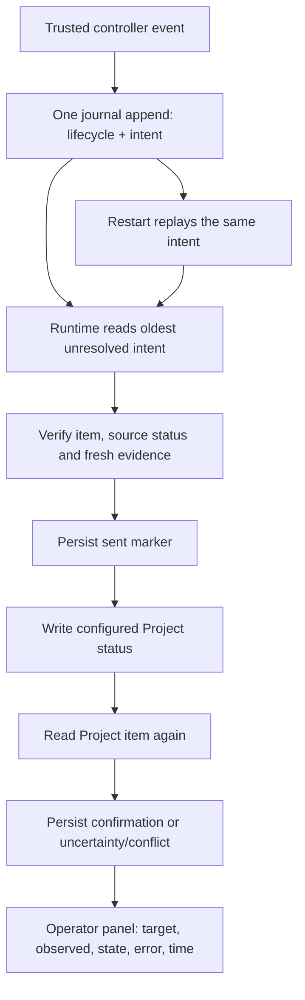

# Durable controller status synchronization

Stage 2 of the [second-pilot plan](second_pilot_implementation_plan.md) provides the journal and
transport foundation. Stage 3 connects the existing lifecycle and operator actions to it when
all seven roles are configured. Four-role profiles retain their existing publication behavior.
This change alone does not activate a pilot or move existing cards.

## Ownership and atomic intent

The controller owns status writes and its GitHub App credentials. No new agent tool, arbitrary
GraphQL endpoint, service, or database is introduced. The trusted controller records a lifecycle
transition and its status intent together through `DeliveryGate` (or the existing trusted
`DeliveryRuntime.command/5` boundary):

```elixir
DeliveryRuntime.command(runtime, version, event_id, "status_transition", %{
  "action" => "block",
  "args" => %{"reason" => "Worker failed"},
  "from" => "Agent working",
  "repo" => "ExampleOrg/app",
  "reason" => "Worker stop confirmed; owner decision required"
})
```

The caller supplies a stable event ID, current journal version and observed source status.
The command applies the existing lifecycle validation and derives the target role from the
resulting phase. Accepted actions are `start_work`, `block`, `handoff`, `review_started`,
`review_resume`, `resume`, `merged`, and `complete`. `review_started` is an explicit event
allowed only in `awaiting_review`; it does not itself grant execution permission.

An intent retains its ID, event revision/time, reason, repository, cycle and task identity,
source status, target role, phase/work/deployment/validation evidence, observed status,
attempt counts, retry time, error, send marker and confirmation time. It is stored at the
snapshot root, so `complete` moving a cycle to `last_cycle` cannot discard it. An unresolved
intent prevents admission/reservation of another task and automatic completed-cycle shutdown.
An explicit Stop can leave it pending for the next start.

Status writes do not depend on a workpad comment succeeding. In a seven-role profile Runtime
wraps its events in the durable `lifecycle` command. Worker admission records the initial intent
in the same write as the time interval. `project_start` acknowledges this event. New publication
effects carry `status_owner: controller` and omit their old status step; verified CI and native
linkage lead to handoff, which records the status intent. Legacy effects keep their old step list.

The lifecycle wrapper also records budget exhaustion, abnormal worker exit, a normal exit without
handoff, agent blocking, publication errors, failed deployment and negative manual validation.
Rate limits and ordinary CI/deployment waits do not themselves become terminal failures.
Operator pause remains a hold; improved deployment evidence alone does not resume a blocked cycle.
During a hold, stale unsent intents can be superseded and sent intents can be reconciled by
reading. This lets a subsequent blocking intent drain after restart. Revoking `Agent allowed`
prevents a new working write; it does not prevent reading the outcome of an already sent write.

## Configuration and compatibility

`tracker.provider.states` accepts either the existing four roles or the complete seven-role map:

```yaml
states:
  ready: Ready for agent
  working: Agent working
  blocked: Needs human decision
  handoff: PR ready
  review: Human review
  dev_validation: Dev validation
  production_ready: Ready for production
```

Names must be unique and present in the Project schema. The three additional roles must be
neither active nor terminal tracker states. `production_ready` is not `Done` and does not
deploy production. Existing defaults remain the original four roles; an intent whose role
has no configured target fails visibly without a write.

Legacy schema-1 journals replay to the same state shape: the optional `status_sync` field
appears only after the first explicit new command. A replayed event ID does not add an intent.
No historical `completed` cycle receives a synthetic event. Old binaries cannot replay the
new commands, so rollback must not feed a new journal to an old runtime.

The status mapping participates in the existing scope fingerprint. Extending a configured
four-role installation therefore requires explicit, verified profile/store migration;
hot reload returns `restart_required`. This stage neither rewrites the installed store nor
changes profile pins.

## Sending, verification and recovery



The existing runtime schedules one status task at a time outside a publication task. The initial
working status can synchronize while its admitted worker runs; it refreshes the watch digest
only after verifying that all other remote pointers remain unchanged. Worker mutations wait
for synchronization (context/start/block tools remain available). Blocking can be reported after
an unconfirmed worker stop without granting another worker permit. Publication writes wait
while status work is unresolved.
The send permission is bound to the task PID, operation ID and journal version. Stop, restart
requirements or an intervening journal command revoke permission before sending.

Before a write, the task checks repository, selected Project item, issue identity, archive
flag and current status. Working additionally requires `Agent allowed=yes` and the saved
base SHA still being current dev. Blocking can report a failure after permission to run was
revoked. Handoff/review require the assigned open PR, exact head/base CI success, and native
issue–PR linkage. Post-merge roles allow a closed issue only for the retained task and require
the assigned merged PR and included merge ancestry. Production readiness additionally requires
the same successful deployment SHA/workflow/run/attempt as the saved positive manual validation.

After evidence collection the task reads the card again, then obtains the durable send
permission. If the target already exists, it verifies applicable evidence and confirms without
another mutation. A stale unsent intent is superseded; a stale sent intent is reconciled by
reading, never written again. Another observed source status produces a visible conflict.

| State | Meaning |
| --- | --- |
| `pending` | Intent stored; no mutation started |
| `sent` | Durable marker saved before mutation; outcome may be unknown |
| `confirmed` | Target read back and confirmation stored |
| `retry` | No ambiguous write; retry after persisted delay |
| `unknown` | Unconfirmed result; a sent marker forbids repeating the write |
| `conflict` | Card or evidence changed; automatic processing stops |
| `failed` | Scope/permissions invalid or retry limit reached; automatic processing stops |
| `superseded` | Unsent event no longer reflects current retained facts |

Only `confirmed` and `superseded` resolve an intent. A known rate-limit rejection permits a
retry; transport errors, malformed responses and readback outages preserve uncertainty.
Backoff is normally 30 seconds and honors available server rate-limit delays. There are at
most three mutation attempts and ten completed reconciliation attempts per intent; the
counters survive restart. Each runtime task has a 60-second deadline. Failure, timeout or
restart retains the journal record. An authenticated operator recheck opens another bounded batch;
an ambiguous sent mutation retains its fence and cannot be sent again.

The panel shows target, observed value, pending/error state and confirmation time. It does
not expose credentials, raw GitHub responses or the private store.

## Operator actions in the seven-role profile

- **Начать review** records an explicit decision, requires the assigned open PR and exact CI
  head/base, then synchronizes `Human review`. Merely viewing the page does nothing.
- **Вернуть PR на доработку** accepts the same allowed card in handoff/review/blocked columns,
  retains its branch and PR, verifies the validated base and adds an explicit budget. It does
  not require a preparatory manual move to Ready.
- **Продолжить ту же задачу** accepts the same open allowed blocked card before merge. After
  merge it resumes dev validation using the assigned merged PR and current successful deployment,
  including for a closed issue. It does not start a worker after merge or lift operator pause.
- **Проверка dev не пройдена** records a negative validation for the current deployment and blocks
  the cycle. A later successful deployment updates evidence but leaves this decision in place.
- **Повторно сверить статус доски** opens a new bounded reconciliation batch with an authenticated
  reason. A known rejected write can be attempted again after permissions recover. An ambiguous
  sent write keeps its send fence and is read only; this action cannot declare it successful,
  force a manual conflict, refund CI budgets, or repeat a push/PR creation.

All forms bind to journal version, project/PR/CI/deployment facts, session and actor. Conflicts
and unknown publication outcomes continue to require evidence; these controls do not discard them.

## Limits and validation

GitHub Projects has no transaction shared with the local journal and this writer has no
compare-and-swap mutation. A manual change between the final read and mutation remains
possible. Readback detects many conflicts but cannot prove that no intervening edit occurred.
The plan's under-60-second synchronization goal requires measurement in the later live pilot;
it is not guaranteed during API outages or slow evidence collection.

Tests use real Gate/Runtime OTP processes, temporary private Linux stores and controlled API
responses. They cover replay, completion, restart before sending, accepted writes with lost
responses, revision revocation, timeout/crash, rate limits, permissions, source conflicts,
fresh proof and operator rendering. They neither start Codex nor write to live GitHub.
Run `make -C elixir all` from the repository root with the configured Elixir/OTP toolchain.
