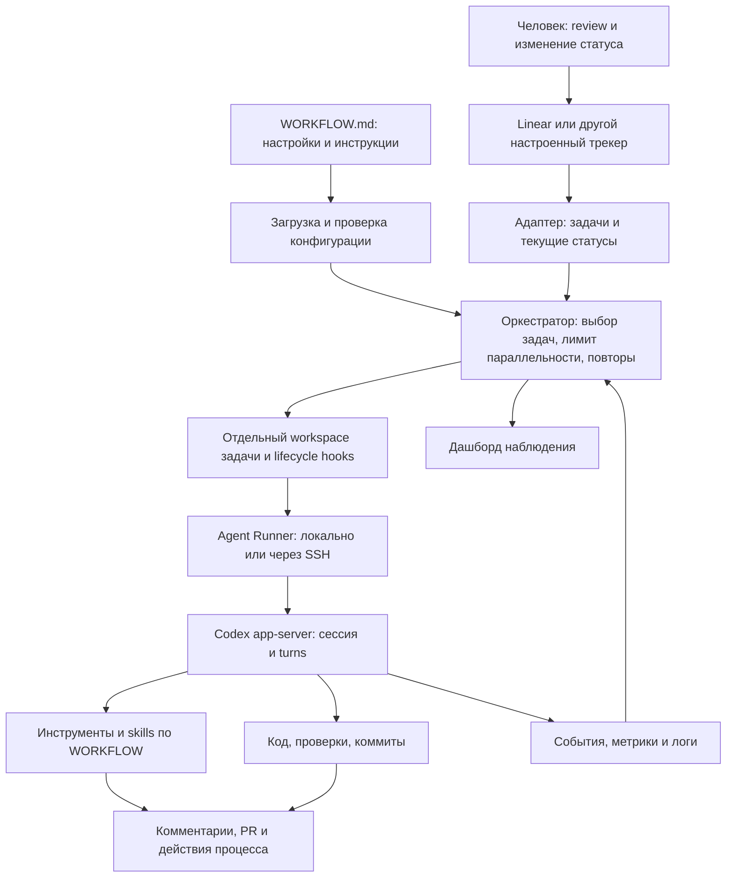
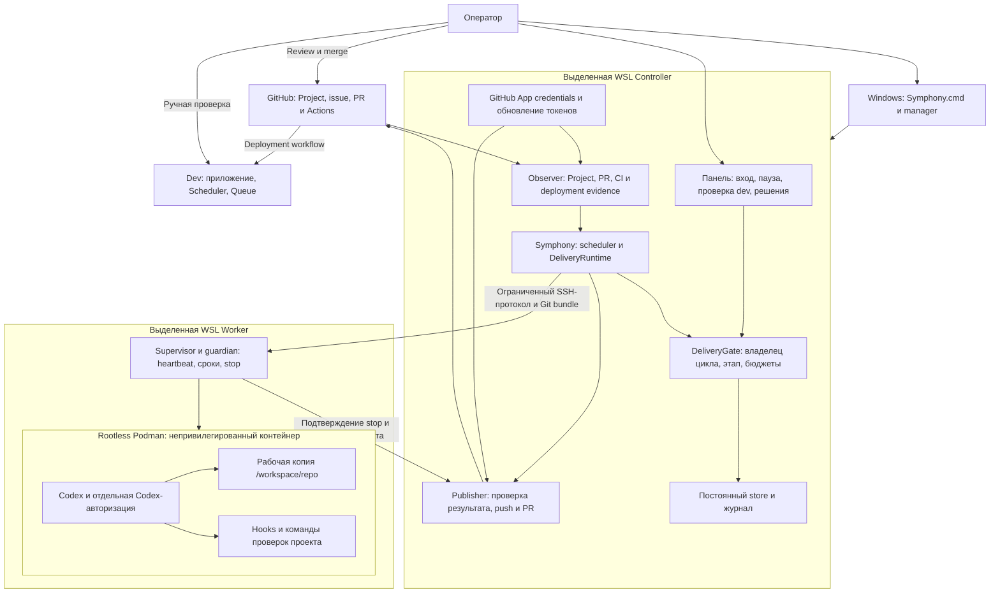
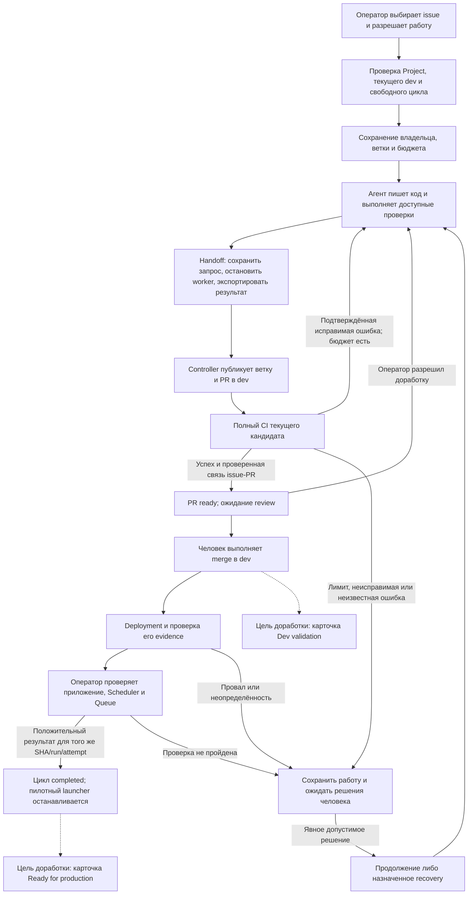

# Отчёт: обоснование и состояние разработки форка Symphony

Дата анализа: **21 сентября 2026 года**. Проверенная ревизия форка: **`6508642`**, включающая изменения `95f94d6`. Исходная база OpenAI для сравнения: **`e0ccc83720a42a600a53b61c5f8d3e518bebe1db`**.

## 1. Главное обоснование выбранного подхода

**Форк нужен для управляемого выполнения задач EmotionStat до проверенного результата в `dev`: с явным допуском, ограниченными полномочиями агента, сохранением работы и обязательным участием человека в review и проверке приложения.**

Исходная Symphony предоставляет основу: читает трекер, выбирает задачи, создаёт рабочие каталоги, запускает Codex, обрабатывает повторы и показывает состояние. Проектный процесс в значительной степени задаётся инструкциями в `WORKFLOW.md` и инструментами агента. Такая архитектура подходит для подготовленного доверенного окружения, но сама по себе не обеспечивает весь принятый процесс EmotionStat.

В выбранном процессе завершение работы агента ещё не означает завершение задачи. Нужно дождаться PR CI, review, ручного merge, актуального deployment и ручной проверки приложения, Scheduler и Queue. До этого следующая обычная задача не должна занимать цикл репозитория. Эти условия должны сохраняться после остановки программы, потери связи и перезапуска компьютера.

Поэтому выбран **форк с постоянным состоянием цикла и контролем исполнения на controller**. Агент пишет код и предлагает результат; controller проверяет допуск, хранит состояние и выполняет ограниченные операции публикации; оператор принимает решения, которые требуют человеческой оценки.

### 1.1. Требования, которые определили архитектуру

| Требование | Выбранное решение | Что оно обеспечивает |
| --- | --- | --- |
| Управлять работой через GitHub Projects | Отдельный адаптер Projects v2 | Допуск по карточке, статусу, репозиторию и `Agent allowed`, а не только по наличию issue |
| Не начинать следующую задачу на непроверенной базе | Один незавершённый цикл репозитория | Ожидание review/deployment/validation удерживает очередь даже без работающего агента |
| Не терять работу после сбоя | Постоянное состояние и журнал переходов | Сохранение владельца задачи, ветки, PR, бюджетов и незавершённых операций |
| Ограничить полномочия модели | Узкие инструменты и публикация через controller | Агент не выдаёт себе разрешение, не подтверждает dev и не выбирает произвольное назначение публикации |
| Выполнять команды проекта на личном компьютере | Отдельные WSL-среды и контейнер worker | Разделение кода проекта, controller credentials и файлов Windows |
| Не путать зелёный Actions с работающим приложением | Проверяемый отчёт deployment и отдельная ручная validation | Подтверждение относится к конкретному коммиту, запуску и попытке |
| Воспроизводить принятую конфигурацию | Закреплённые ревизии Symphony, профиля и образа | Обновления не подменяют проверенную конфигурацию незаметно |
| Запускать систему без ручного управления терминалами | Windows installer и manager | Повторяемые Setup/Start/Stop, диагностика и сохранение состояния |

### 1.2. Почему выбран форк, а не другие варианты

Следующая оценка объясняет технические основания подхода; она не утверждает, что все альтернативы проходили отдельный эксперимент или формальное согласование.

| Вариант | Преимущество | Почему недостаточен для принятого процесса |
| --- | --- | --- |
| Только изменить `WORKFLOW.md` | Минимум нового кода | Инструкция модели не заменяет сохранение цикла, проверку остановки, разделение credentials и контроль публикации |
| Добавить только Projects-адаптер | Быстро связать доску с существующим runner | Не решает ожидание проверенного dev, восстановление после сбоев и изоляцию на Windows |
| Сделать внешний скрипт вокруг Symphony | Подходит для простого запуска и настройки | Контроль затрагивает внутренние retry, turns, hooks и cleanup; внешний скрипт не контролирует их полноценно |
| Написать собственный runner с нуля | Полная свобода архитектуры | Потребовалось бы заново реализовать запуск Codex, трекеры, повторы, workspace lifecycle и наблюдаемость |
| Развивать существующую Symphony в форке | Сохранение работающей основы и доступ к нужным точкам контроля | Требует сопровождения отличий от upstream и проверки интеграции при обновлениях |

Разделение на три места хранения уменьшает связанность: **Symphony** содержит общий механизм, **agent-runner** — workflow/hooks/проверки EmotionStat, **локальная конфигурация** — параметры компьютера и ссылки на секреты. Код приложения остаётся в `EmotionStat/app`.

### 1.3. Оценка соразмерности

Выбранная архитектура в основном оправдана заданными требованиями. Наибольшую ценность дают изоляция, ограниченная публикация, сохранение незавершённого цикла и проверка dev перед дальнейшей работой.

При этом объём первой версии превышает минимум для одного пилота. Развитые recovery-сценарии, подробный учёт резервов и переносимый установщик можно было вводить позже. Более узкий MVP мог останавливаться после одной задачи и передавать исключительные ситуации оператору с сохранённой работой.

Цена текущего подхода — сопровождение Elixir, Python, PowerShell, GitHub API, Codex app-server, WSL, Podman и форматов состояния. Обоснованность этих вложений следует подтверждать повторяемой эксплуатацией. Следующий приоритет — закончить уже выбранный пользовательский путь и приёмку поставки, не расширяя набор возможностей без необходимости.

### 1.4. Термины, используемые в отчёте

| Термин | Значение |
| --- | --- |
| Controller | Управляющая часть: проверяет условия, хранит состояние и публикует результат |
| Worker | Среда, в которой агент исполняет команды и меняет код |
| Gate / допуск | Программная проверка того, разрешено ли начать или продолжить действие |
| Delivery-цикл | Весь путь одной задачи от допуска до проверки результата в dev |
| SHA | Идентификатор конкретной версии кода в Git |
| Run / attempt | Запуск workflow GitHub Actions и номер его повторной попытки |
| Evidence | Проверяемые сведения о том, какой код и какие этапы были выполнены |
| Handoff | Передача подготовленного результата от агента управляющей части |
| Recovery | Отдельно разрешённое восстановление после проблемы с сохранением незавершённой работы |
| Pin / manifest | Закреплённая версия компонента / описание согласованного набора компонентов |
| Fixture / smoke | Контролируемые тестовые данные / короткая проверка основных функций реальной среды |

## 2. Основания отчёта и границы достоверности

Изучены история Git, исходные файлы на базе OpenAI, текущие модули форка, [план адаптера](github_projects_adapter_plan.md), [поэтапный план](github_projects_pr_rollout_plan.md), [план установщика](../../tools/wsl/installer-plan.md) и сохранённые отчёты проверок.

- **Реализовано** означает наличие соответствующего кода в исследованной ревизии либо явно указанное подтверждение в отчёте другого репозитория.
- **Проверено** означает результат конкретного сохранённого прогона. Полный набор тестов при подготовке этого документа заново не запускался.
- **Пилот подтверждён** означает наличие записи о реальном результате в документации. Живое состояние GitHub, Cloudflare и установленной среды сейчас не перепроверялось.
- **Запланировано** означает, что описание целевого поведения не считается доказательством реализации.
- Код `EmotionStat/app`, `agent-runner` и knowledge-base отдельно не анализировался. Их результаты приведены по документам Symphony; полный аудит тех репозиториев остаётся отдельной работой.

Номера **PR-01…PR-15 — этапы плана**, они не совпадают с номерами pull request в GitHub. Например, GitHub PR #13 включает установщик и операторские команды, а этап PR-13 описывает интеграцию runtime.

Некоторые старые вводные записи планов отстают от истории Git. Утверждения «execution ещё отключён» относятся к промежуточным этапам; текущий профиль допускает явно выбранный пилот. Шесть исправлений пилота уже включены в Git через `95f94d6` и merge `6508642`, хотя отдельные абзацы ещё называют их незакоммиченными. Это не доказывает готовность обновлённого установочного комплекта.

## 3. Как устроена исходная Symphony OpenAI

### 3.1. Компоненты и настройки

В исходной архитектуре Symphony — постоянно работающий оркестратор. Первая версия ориентировалась на Linear; к исходной базе данного форка OpenAI уже добавила GitHub Issues, Jira, Asana, GitLab, SSH-worker и Phoenix-дашборд. Эти возможности не являются новыми разработками форка.

`WORKFLOW.md` содержит YAML-настройки и шаблон задания агенту. Настройки определяют трекер, статусы, период опроса, workspace, hooks, параллельность и параметры Codex. Текст workflow задаёт порядок разработки, проверки, ведения отчёта и передачи результата.

Схема показывает распределение ответственности, а не обязательный для каждого трекера набор прав. В исходном Linear-workflow агент готовит PR и ожидает review; после перевода человеком задачи в `Merging` workflow предусматривает выполнение процедуры merge агентом.

### 3.2. Что исходная версия обеспечивает и чего не требует

Оркестратор ограничивает одновременные запуски, повторяет работу после временных ошибок, сверяет статус задачи и сохраняет рабочую папку для продолжения. Настройки могут обновляться, а события агента доступны для диагностики.

Точное состояние планировщика хранится в памяти; восстановление опирается на трекер и файловую систему. Спецификация не требует постоянного журнала всей цепочки до deployment и ручной проверки приложения. Также она не требует единого контейнерного профиля: степень изоляции определяется настройками агента и хоста.

Следовательно, исходная отдельная рабочая папка и SSH-запуск не равнозначны границе доступа, которую добавляет форк. И исходное завершение агентской сессии не равнозначно завершению принятого в EmotionStat delivery-цикла.

## 4. Как будет работать форк

### 4.1. Размещение и границы доступа

Основные компоненты следующей схемы реализованы. Полная приёмка нового комплекта и отдельные эксплуатационные доработки перечислены далее.

Controller хранит секрет GitHub App, операторский credential и состояние. Worker получает данные конкретной задачи и отдельную Codex-авторизацию. Рабочие команды не получают GitHub-токен, домашние каталоги controller, Windows-диски, Docker/Podman socket или SSH agent хоста.

Сетевая защита состоит из разных уровней: внешний runtime блокирует доступ к host/private endpoints; актуальная политика sandbox команд агента дополнительно отключает публичную сеть этих команд. Это не означает отсутствия необходимого соединения самого Codex с сервисом модели. Ранние контейнерные проверки с публичным HTTPS не доказывают доступность сети для команд агента в текущем профиле.

### 4.2. Целевой цикл задачи

Пунктир обозначает ещё не завершённую синхронизацию последующих этапов с доской. При возврате до merge сохраняются ветка и существующий PR. Recovery после merge назначается отдельно и использует собственную ветку/PR; это не повторный запуск старой задачи без проверки условий.

`completed` означает завершение внутреннего dev-цикла. Оно не означает выпуск в production или статус `Done`. В текущем профиле после единственного пилота следующая обычная задача автоматически не запускается.

## 5. Этапы основного плана

### PR-01. Согласовать описание процесса в базе знаний

**Статус:** отложен по решению владелицы и объединён с PR-15.

**Для чего и что обеспечивает.** Закрепить, кто разрешает задачу, кто принимает PR, кто проверяет dev и когда можно начинать следующую работу. Устранить противоречия между базой знаний, правилами приложения и исполняемым workflow.

**Как предусмотрено.** Обновить документы процесса и Action Register в knowledge-base; определить Symphony как общий механизм, agent-runner как место исполняемого workflow, app как источник продуктовых проверок. Отдельно описать границу между проверенным dev и production.

**Что проверено.** В плане зафиксированы объём и решение об отсрочке. Фактический diff базы знаний и её валидатор в рамках данного анализа не проверялись.

**Что ещё выполнить.** После завершения исправлений пилота перенести подтверждённые решения вместе с PR-15, сохранить существующие правки, проверить ссылки, метаданные и обязательный валидатор vault. Не закрывать открытые действия на основании одного наличия плана.

### PR-02. Читать GitHub Projects и выполнять конечную инспекцию

**Статус:** реализован в форке.

**Для чего и что обеспечивает.** Получать задачи по правилам доски и до запуска видеть причины допуска или исключения каждой карточки. Инспекция не должна иметь побочных эффектов исполнения.

**Как реализовано.** Добавлены `github_projects` adapter/client/schema/normalizer/inspection, проверка полей и option IDs, пагинация, точный repo/item scope и JSON `--dry-run`. Project item ID отделён от issue ID. На промежуточном этапе запуск нового provider был запрещён во всех entrypoints до последующей интеграции.

**Что проверено.** По отчёту этапа: 342 Elixir-теста, 0 ошибок, 6 пропусков; форматирование, specs, Credo, Dialyzer, escript/Burrito и GitHub CI. Проверялись неполная пагинация, неоднозначная схема, архив, закрытые/чужие карточки и отсутствие runtime/hook/workspace effects. Живая инспекция с App подтверждена на PR-03.

**Что ещё выполнить.** При изменении схемы Project повторять discovery и проверку соответствия статусов. Будущая полная синхронизация доски потребует дополнительных write-role и проверки их наличия; существующие четыре роли этого не обеспечивают.

Источник: [адаптер и инспекция](github_projects.md).

### PR-03. Управлять GitHub App credentials на controller

**Статус:** реализован; реальная read-only авторизация подтверждена сохранённым отчётом.

**Для чего и что обеспечивает.** Длительный цикл не зависит от срока жизни однажды выданного токена; worker не получает полномочия менять допуск на доске или обращаться к произвольному репозиторию.

**Как реализовано.** Controller проверяет identity установки и права, получает ограниченные installation tokens, кэширует их и обновляет до истечения. Одновременные refresh объединяются. Профили чтения, публикации, Contents и Projects разделены. Ошибка App не вызывает скрытый переход на PAT; неизвестная запись не повторяется автоматически после обновления токена.

**Что проверено.** Зафиксированы 369 Elixir-тестов, успешные escript/Burrito и GitHub CI. Живая инспекция подтвердила нужную identity, scope и завершение без запуска worker. На момент этой инспекции доска была пустой; непустая доска проверялась fixtures и позднее пилотом.

**Что ещё выполнить.** Проверять реальные grants и ротацию при изменении установки. В новом комплекте повторно подтвердить точный профиль публикации с `contents: read`, добавленный после отказа создания пилотного PR. Право Projects уровня организации дополнительно ограничивается кодом по конкретной доске.

Источник: [credentials](github_app_credentials.md).

### PR-04. Проверять PR приложения до merge

**Статус:** относится к `EmotionStat/app`; реальный успешный PR CI указан в результате пилота. Полнота реализации отдельно не аудирована.

**Для чего и что обеспечивает.** Выявлять ошибки до изменения dev и дать controller однозначный проверяемый результат для текущего кандидата.

**Как предусмотрено и описано в плане.** PR workflow для `dev` вызывает общий набор verify без deployment/production secrets. Итоговый check имеет стабильное имя. Проверка итогового dev перед deployment сохраняется. Для основного verify согласован тайм-аут 20 минут, отдельный от бюджета агента.

**Что проверено.** План фиксирует успешный CI пилотного PR №133 на candidate SHA. Это подтверждает один успешный путь, но не заменяет проверку прав workflow, отказов, пропущенных jobs и required-check rules в app.

**Что ещё выполнить.** Для окончательной приёмки приложить актуальный app SHA и отчёты положительных/отрицательных сценариев, сверить серверные правила merge и stable check. Закрепить согласованную offline-политику: доступные проверки локально, недоступные явно отмечены, полный актуальный CI обязателен до `PR ready` и merge.

Источник: [основной план, PR-04](github_projects_pr_rollout_plan.md#pr-04--проверять-app-pr-до-merge).

### PR-05. Выпускать проверяемый отчёт deployment

**Статус:** контракт находится в app; его чтение и применение подтверждены последующими этапами и записью о пилоте.

**Для чего и что обеспечивает.** Отличать успешный актуальный deployment от старого зелёного run, неполной повторной попытки и скрытой ошибки финальных шагов.

**Как предусмотрено.** Deployment публикует версионированный evidence artifact с repo, SHA, workflow/run/attempt и результатами обязательных jobs, шагов и finalizers, включая Scheduler/Queue. Политика отчёта закрепляется по версии. Deployment success не подменяет ручную проверку приложения.

**Что проверено.** Observer PR-07 прочитал реальный artifact и сверил digest/jobs. В пилоте зафиксированы успешный deployment и ручная validation для одного SHA/run/attempt. Полный набор producer-тестов app в этом отчёте не подтверждается отдельно.

**Что ещё выполнить.** При изменении app-контракта повторять producer/consumer проверки: неверный SHA, новый attempt, failed/cancelled finalizer, частичный rerun, унаследованная Queue pause. Не объявлять partial rerun поддержанным без полного доказательства. Согласовать новые pins при изменении контракта.

Источники: [план](github_projects_pr_rollout_plan.md), [интеграция evidence](github_projects_setup/deployment-evidence-integration.md).

### PR-06. Сохранять цикл репозитория и бюджеты

**Статус:** реализован.

**Для чего и что обеспечивает.** Завершение worker, restart или изменение карточки не освобождают незавершённую задачу и не обнуляют расходы. Один цикл удерживается до проверенного завершения или допустимой отмены.

**Как реализовано.** `DeliveryGate` и модель переходов хранят owner, task, фазу, ветку/PR, SHA/run/attempt, validation, recovery и бюджеты. Linux helper обеспечивает одного писателя через `flock`, атомарную замену, `fsync`, checksum и previous-копию. Версии и ID команд защищают от устаревших действий и двойного применения. Replay проверяет согласованность состояния с журналом.

Принятые бюджеты: 60 минут первоначальной работы, отдельно 60 минут исправлений суммарно, максимум два цикла исправления, шесть PR CI-попыток и до двух инфраструктурных повторов на одном SHA. Ожидание CI/оператора после подтверждённого stop не расходует активное время; подготовка, hooks и локальные проверки расходуют. Перезапуск и новый коммит не обнуляют счётчики. При `Actions: read` повтор CI без изменения кода запускает оператор, а controller учитывает попытку; наличие лимита не означает наличие автоматического rerun.

**Что проверено.** По [отчёту PR-06](github_projects_setup/pr06-description.md): 405 Elixir-тестов и 8 Python-тестов; конкурирующие писатели, restart, повреждённое/отсутствующее состояние, устаревшие команды, отмена/recovery и crash/replace/fsync.

**Что ещё выполнить.** Необходимы проверенные эксплуатационные процедуры восстановления и, перед длительной работой, архивирования ограниченного журнала. Автоматический сброс или миграция несовместимого store не предусмотрены. Несколько копий store на разных компьютерах не образуют распределённую блокировку.

Источник: [постоянный цикл](delivery_cycle.md).

### PR-07. Наблюдать Project, PR, CI и текущий dev

**Статус:** реализован.

**Для чего и что обеспечивает.** Принимать решения на свежих внешних фактах. Ограничение исполнения одной пилотной карточкой не должно скрывать другую блокирующую работу в репозитории.

**Как реализовано.** Observer сверяет Project, PR, принадлежность цикла, merge ancestry, dev SHA, workflow и конкретную попытку запуска. Evidence проверяется по закреплённой политике, digest, receipts и GitHub jobs. Неполное чтение означает неизвестный результат, а не отсутствие препятствий.

**Что проверено.** 445 Elixir-тестов и 8 Python-тестов; синтетические и небезопасные архивы, устаревшие данные и изменённая версия цикла. Сохранено живое чтение run `35095177024/1`, artifact `10446890300` с проверкой digest и jobs.

**Что ещё выполнить.** Сохранять согласованность с обновлениями app evidence; включить случаи изменения dev другими участниками и потери связи в приёмку обновлённого комплекта. Observer не заменяет ручную проверку приложения или живое чтение Cloudflare API.

Источники: [observer](github_projects_delivery.md), [проверки](github_projects_setup/pr07-description.md).

### PR-08. Подключить допуск к lifecycle агента

**Статус:** реализован; производственный транспорт подключён последующими этапами.

**Для чего и что обеспечивает.** Retry, continuation, hooks, turns и cleanup подчиняются одному владельцу цикла. Ограничение действует не только в момент выбора задачи.

**Как реализовано.** `DeliveryRuntime` резервирует время до внешних действий, выдаёт одноразовый допуск процессу, выполняет наблюдение и монотонный учёт времени, отзывает разрешение при нарушении условий. Незавершённые workspace сохраняются. Hook context содержит данные задачи, но не секреты или полномочия. Неподтверждённая остановка удерживает цикл.

**Что проверено.** 473 Elixir-теста и 8 Python store-тестов, реальные OTP-процессы и интеграционные сценарии. Проверены удержание A во время review, отказ запуска B, запрет обхода через retry, pause/recovery, stale observations, cleanup и контекст local/SSH.

**Что ещё выполнить.** В окончательном комплекте повторно проверить исправленную гонку старой полной сверки с новым worker и передачу контекста app-server. Подтвердить остановку внешних процессов в сценариях Windows sleep/resume и потери manager.

Источники: [runtime](delivery_runtime.md), [проверки](github_projects_setup/pr08-description.md).

### PR-09. Ограничить инструменты и обеспечить восстановление публикации

**Статус:** реализован; пилот выявил уточнение прав публикации, уже вошедшее в Git.

**Для чего и что обеспечивает.** Агент работает только со своей задачей; публикация не теряется при restart и не создаёт дубликаты при неопределённом ответе GitHub. `PR ready` появляется после актуального CI и подтверждённой связи issue–PR.

**Как реализовано.** Шесть task-bound tools передают намерения controller. Publisher сохраняет операцию, подтверждает stop, проверяет неизменяемый bundle в отдельном bare repository и публикует только назначенную ветку. Прямой push в `dev`/`main`, force/delete/mirror и произвольные API-запросы не предоставляются. Native linkage проверяется отдельно от ссылки в тексте PR.

**Что проверено.** 508 Elixir-тестов, 8 store- и 9 publisher-тестов; конкурентное изменение refs, недоверенные hooks, сохранение эффектов и ограничение полномочий. Пилот подтвердил реальное создание PR, CI, linkage и переход в `PR ready`, но после технического вмешательства.

**Что ещё выполнить.** Различать окончательный отказ GitHub и неизвестный результат записи в понятной оператору диагностике; проверить восстановление при обрыве ответа и restart между созданием PR, linkage и статусом. Полная синхронизация доски из lifecycle controller остаётся открытой.

Источники: [публикация](github_projects_publication.md), [проверки](github_projects_setup/pr09-pr-description.md).

### PR-10. Добавить защищённые действия оператора

**Статус:** реализован, включая отдельное ручное подтверждение Queue/Scheduler.

**Для чего и что обеспечивает.** Человек может управлять паузой, отменой, бюджетами и проверкой dev через панель; решение сохраняется и относится к конкретному состоянию системы.

**Как реализовано.** Локальная авторизация, сессии, Host/Origin/CSRF-проверки и версионные формы поверх того же Gate/store. Validation и завершение записываются атомарно. Queue confirmation привязана к proof/artifact/policy; до отдельной validation действует 30 минут. Сообщение о проблеме сохраняется независимо от зелёного deployment.

**Что проверено.** Финальный зафиксированный gate этапа: 549 Elixir-тестов, 17 Python-тестов, форматирование/specs/Credo/Dialyzer. В браузере пройдены login, устаревшая форма из второй вкладки, ручная validation и Queue confirmation на fixture demo с реальным Runtime/Gate. Живая validation указана позднее в результате пилота.

**Что ещё выполнить.** Завершить удобный путь продолжения из `Needs human decision` без ручного перетаскивания карточки; согласовать UI с полной синхронизацией доски. Расширенный repair и восстановление неопределённых интервалов нельзя считать доступными только из-за существования базовых кнопок. Панель рассчитана на loopback, не на публичное размещение.

Источники: [панель](operator_dashboard.md), [приёмка](github_projects_setup/pr10-validation.md).

### PR-11. Создать переносимый изолированный runtime

**Статус:** реализован, техническая граница проверена в конкретном WSL/Podman-профиле.

**Для чего и что обеспечивает.** Команды проекта выполняются отдельно от controller и хоста; stop и потеря связи приводят к проверяемому завершению процессов с сохранением результата.

**Как реализовано.** Общий Python runtime, root-owned supervisor, непривилегированный guardian, rootless Podman, ограниченный management SSH и task SSH внутри контейнера. Добавлены cgroup/network/seccomp/resource restrictions, heartbeat/deadline, импорт/экспорт bundle, config/manifest/pin/preflight/launcher. Токены GitHub остаются у controller.

**Что проверено.** 552 Elixir-теста, 17 store/publisher и 29 runtime-тестов. Реально проверены SSH, app-server initialize, недоступность host files, ресурсы/привилегии, сетевые canaries, завершение дочерних процессов, deadline, crash/restart и сохранение коммита. Потеря controller приводила к stop примерно через 45,4 секунды. Smoke повторён с другим account и после WSL restart.

**Что ещё выполнить.** Повторять приёмку при смене ядра, Podman, systemd и образа. Закрыть контроль физического Windows-диска и финальные manager/sleep сценарии. Поддержка иных платформ, распределённое владение и общий размер task volume не считаются обеспеченными этими тестами.

Источники: [runtime](../../runtime/README.md), [приёмка](github_projects_setup/pr11-validation.md).

### PR-12. Подготовить проектный профиль EmotionStat

**Статус:** реализация и локальная контейнерная приёмка зафиксированы в отчёте agent-runner; его актуальная ветка отдельно не проверялась.

**Для чего и что обеспечивает.** Связать общий runner с реальным устройством app: базой `dev`, правилами веток, инструментами и командами проверки продукта.

**Как реализовано по отчёту.** `WORKFLOW.template.md`, hooks new/continue/recovery, каталог проверок и производный image. Controller передаёт dev bundle; hook проверяет контекст и SHA. Продолжение сохраняет ветку/PR, dirty work и конфликты; новый dev вливается обычным merge. Worker не выполняет сетевые Git fetch/push. Проверки, выполняемые только CI, отмечаются отдельно.

**Что проверено.** 31 profile-тест; реальные renderer/Config/Liquid/guard, Git negatives, local bare publisher и контейнерная приёмка. Успешно выполнены 36 локальных шагов приложения; Docker build оставлен `ci_only`. Исправлена передача больших bundle, предел отдельного файла согласован и повышен до 256 MiB; остановка и изоляция повторно проверены.

**Что ещё выполнить.** Закрепить последующее решение об offline-командах в принятой версии профиля: недоступная проверка явно отмечается, реальный провал не выдаётся за skip/success, полный CI остаётся обязательным. В новом комплекте проверить согласованность image, hooks, контракта и Symphony pins.

Источник: [приёмка PR-12](github_projects_setup/pr12-validation.md).

### PR-13. Подключить runtime и проверить собранную систему

**Статус:** реализован в Symphony; интеграционная и локальная контейнерная приёмка зафиксированы.

**Для чего и что обеспечивает.** Соединить ранее проверенные компоненты в один реальный запуск, сохранив закрытый по умолчанию допуск и воспроизводимую конфигурацию.

**Как реализовано.** Manifest v2 и launcher activation связывают source/profile/image/workflow. Подключены prepare/start/heartbeat/stop/export. Реализованы изолированный login, `model/list`, локальный выбор модели и reasoning effort с фиксацией на цикл и проверкой ответа app-server. Добавлены итоговый отчёт, retention успешных данных и контроль места внутри Linux. Принят профиль одного пилота.

**Что проверено.** 575 Elixir-тестов, 55 runtime Python, 17 store/publisher и 31 agent-runner-тест. Проверены модельный протокол, остановка одновременно со status, packaged guards, ограничения хранения и реальные container smoke. CI/review/deployment/validation проверялись связанными интеграционными сценариями с контролируемыми GitHub-ответами; живой продуктовый пилот относится к PR-14.

**Что ещё выполнить.** Принять обновлённый комплект с последующими исправлениями. Проверить согласованные ревизии всех компонентов вместо автоматического перехода на moving branch. Отчёты предыдущих этапов упоминают advisories зависимостей; их закрытие или актуальное решение по ним в исследованных материалах не подтверждено.

Источник: [приёмка PR-13](github_projects_setup/pr13-validation.md).

### PR-14. Выполнить одну настоящую задачу приложения

**Статус:** dev-цикл завершён по сохранённой записи; проход без технического вмешательства и приёмка новой поставки ещё не подтверждены.

**Для чего и что обеспечивает.** Проверить на небольшой продуктовой задаче всю цепочку и выявить разрывы, не заметные в модульных тестах или отдельных smoke.

**Как выполнено.** Выбрана issue [EmotionStat/app №132](https://github.com/EmotionStat/app/issues/132) — изменение цвета кнопки «Поделиться». Создан [PR №133](https://github.com/EmotionStat/app/pull/133) в `dev`. Профиль ограничен выбранной карточкой; review, merge и проверка dev остаются решениями владелицы.

**Что проверено по записи плана.** CI `35363980524/1` успешен на `a213d64436820e5adab71fd483a3fb172f0e77ad`; controller подтвердил native linkage и `PR ready`. PR слит в dev с SHA `b3b7c17a6b12dc3afe62e2a5be58cd6bc645b947`; deployment `35366428380/1` успешен. Для того же SHA/run/attempt сохранена положительная validation; `last_cycle.phase=completed`, активного цикла нет.

**Что ещё выполнить.** Пройти приёмку итогового комплекта без ручной подмены runtime, повторов API и исправления карточек вместо автоматической синхронизации. Обычные операторские решения остаются частью процесса. Выявленные дефекты и незавершённая синхронизация перечислены в разделе 6. Следующая живая задача требует отдельного решения о rollout.

Источник: [результат пилота в плане](github_projects_pr_rollout_plan.md#pr-14--выполнить-одну-выбранную-пилотную-app-задачу).

### PR-15. Обновить канон и принять решение о дальнейшем запуске

**Статус:** итоговое выполнение в knowledge-base не подтверждено; включает отложенный PR-01.

**Для чего и что обеспечивает.** Документы должны описывать фактически проверенную систему и ограничения, а решение о дальнейшем запуске — опираться на результаты, а не на факт merge серии кода.

**Как предусмотрено.** Обновить workflow/PR/deployment policy, Action Register и запись пилота. Указать принятые версии, модель доступа, результаты, случаи ручного вмешательства, открытые дефекты и решение: остановить, исправить либо разрешить следующий ограниченный rollout.

**Что проверено.** Сохранены планируемый объём и evidence пилота в Symphony. Итоговый diff и валидатор knowledge-base не проверялись.

**Что ещё выполнить.** Объединить подтверждённые решения и результаты PR-14, проверить согласованность SHA/run/attempt, ссылки и метаданные; сохранить незакрытые действия. Не обозначать production, восстановление store или постоянный сервис готовыми без соответствующей приёмки.

## 6. Дополнительный план установщика и исправления пилота

Установщик развивался дополнительно к PR-01…PR-15. Его пункты не следует смешивать с номерами основных этапов.

### 6.1. Этапы 1–7: от локального комплекта до работающей установки

| Этап плана установщика | Для чего / как реализовано | Что проверено | Что ещё нужно |
| --- | --- | --- | --- |
| 1. Основа поставки и runtime | Проверка комплекта, конфигурации и совместимости компонентов | Bundle/runtime tests; проверки хешей, извлечения, private files и изменённого checkout | Принять единый комплект со всеми последними исправлениями |
| 2. Возобновляемый мастер | Checkpoints позволяют продолжить Setup после сбоя без создания другой установки | Ошибки пакетов, поздняя неготовность, повтор Setup, сохранение ID/descriptor и ключа | Повторить чистую установку именно финального комплекта |
| 3. Две WSL-среды | Controller и worker отделены от рабочей Ubuntu и Docker Desktop | Созданы две новые среды; isolation smoke проверял их совместную работу | Подтверждать совместимость при изменении WSL/kernel/systemd |
| 4. Подготовка controller/worker | Автоматическая настройка служб, runtime, образа и границ исполнения | Bootstrap/operator tests и реальный smoke; исправлены cgroup path и Interop проверки | Включить исправления в проверенную поставку, не требующую локальных замен |
| 5. Чистая установка | Повторяемый путь без принятия старых окружений под управление | На пилотной машине пройден Setup двух новых WSL, GitHub inspection и Codex login | Итоговая чистая установка из нового комплекта ещё остаётся критерием приёмки |
| 6. Запуск без терминала | Скрытый manager, Start/Stop/Status/Doctor; проверка готовности панели | Настоящий manager с fixture-процессами; реальный Start/Stop/повторный Start после IPv4-исправления | Закрытие окна терминала, сон/пробуждение Windows, утрата manager в полной установленной системе |
| 7. Авторизация и модель | Изолированный login, каталог моделей, выбор модели/effort | Реальные login/model-list/выбор effort на установке; протокольные проверки PR-13 | Повторить после обновления с сохранением авторизации и выбора |

Зафиксированы 60 runtime- и 32 operator/bootstrap/bundle-теста, Windows PowerShell-сценарии и проверка настоящего argv/stdin. Эти числа относятся к отчёту установщика, а не к новому прогону текущей ревизии. Проверки с подменёнными endpoint не заменяют реальную приёмку. Источник: [verification.md](../../tools/wsl/verification.md).

### 6.2. Этап 8: распространение комплекта

**Для чего.** Другой разработчик должен получать воспроизводимую поставку без личных файлов и секретов владельца.

**План реализации.** Версионированный комплект и его получение через Setup, с раздельным учётом доступа к публичному форку и закрытому профилю EmotionStat.

**Статус и проверки.** Отложено по решению владелицы до результатов первого пилота; готовность канала распространения не подтверждена. Нынешний локальный комплект и `.runtime-local/` не появляются у другого разработчика после clone.

**Осталось.** Согласовать выпуск, доступы, получение и проверку версий; пройти чистую установку из опубликованной поставки. Это отдельный этап, не побочный эффект merge текущего кода.

### 6.3. Этап 9: учитывать физический диск Windows

**Для чего.** Свободное место внутри WSL не гарантирует место на Windows-томе, где растёт VHDX. Большой виртуальный диск не является физическим резервом.

**План реализации.** Manager измеряет доступное место на фактических томах установки и передаёт controller свежие привязанные к запуску данные. Проверяется и Linux FS, и Windows-том; общий том двух WSL не считается дважды. Worker не получает доступ к Windows API или дискам.

**Статус и проверки.** Запланировано, не реализовано. Текущий Linux storage readiness не доказывает это условие.

**Осталось.** Реализовать измерения, протокол, ограничения допуска и отображение; проверить пороги, устаревание данных, общий/раздельные тома, падение остатка во время работы, restart и sleep/resume без заполнения реального диска пользователя.

### 6.4. Этап 10: явно выбрать первый пилот

**Для чего.** Установка и изменение карточки сами по себе не должны начинать продуктовую работу.

**Как реализовано.** `Select-Pilot -Issue NUMBER` после подтверждённого Stop проверяет одну открытую разрешённую карточку в Ready и исходный журнал через replay. Создаёт отдельные config/workflow/manifest/state, сохраняет старый профиль и резервную копию descriptor. Повтор того же выбора безопасен; смена карточки не подменяет существующий цикл. Запуск требует `Start -Execute` и отдельного подтверждения исходного dev в новой области допуска.

**Что проверено.** В репозитории есть тесты выбора пилота, отказов, сохранения исходных файлов и передачи `Execute`. Реальный пилот зафиксирован отдельно; результаты полного нового прогона этих тестов в рамках отчёта не заявляются.

**Осталось.** Включить механизм в окончательный комплект и проверить штатный переход Setup → Stop → Select-Pilot → Start -Execute → validation без ручной правки конфигурации.

### 6.5. Этап 11: устранить проблемы первого пилота

Шесть исправлений ниже присутствуют в `95f94d6` и включены merge-коммитом `6508642`. Статус «есть в Git» следует отличать от «выпущено и принято в комплекте».

| Проблема | Как исправлено и зачем | Проверка, требуемая для приёмки комплекта |
| --- | --- | --- |
| Холодный запуск превышал стандартные 5 секунд | Renderer задаёт 60 секунд, сохраняя явную настройку проекта | Медленный запуск проходит; зависший остаётся ограничен тайм-аутом |
| Запоздалая idle-сверка отзывала допуск нового worker | При dispatch отменяется прежнее полное чтение | Гонка не останавливает новый worker; актуальные отрицательные данные всё ещё останавливают работу |
| Codex не получал контекст задачи | App-server запускается через Guard с актуальным контекстом; унаследованное значение очищается | Local/SSH получают нужные cycle/branch/base; отсутствующий контекст и чрезмерный размер обработаны; секреты не передаются |
| Git не мог создать `.git/index.lock` | В sandbox разрешена запись в `.git` контейнерной рабочей копии | Реальные add/commit; сохранение защиты `.codex`/`.agents`, запрета сети команд и изоляции хоста |
| Resume требовал только Ready | Та же открытая разрешённая задача допускается в Ready или Working | Чужая, закрытая, архивная или запрещённая карточка отклоняется; прежние ветка и бюджет сохраняются |
| GitHub отклонял PR из-за недоступных refs | В профиль publication добавлен `contents: read` | Точные permissions/scope; реальный PR, readback/linkage и `PR ready` после CI |

Код содержит целевые регрессионные проверки ряда этих случаев. План фиксирует успешное продолжение пилота после исправлений, но одновременно прямо сохраняет обязательство повторной приёмки установленного комплекта.

### 6.6. Незавершённая синхронизация доски и обработка ошибок

Сейчас `WriteClient.status` принимает роли working/blocked/handoff. Начало работы и штатная блокировка частично зависят от инструмента агента. Авария worker или отказ публикации могут оставить карточку в устаревшем статусе. После merge/deployment/validation меняется внутренний store, но все соответствующие статусы доски ещё не передаются.

Целевая доработка — controller сохраняет намерение изменения карточки по подтверждённому lifecycle-событию и контролирует результат чтением. Она нужна, чтобы пользователь видел фактический этап даже после падения агента.

| Подтверждённое событие | Целевой статус / действие |
| --- | --- |
| Начало или допустимое продолжение | `Agent working` |
| Публикация и ожидание CI | `Agent working`, пояснение текущего этапа в отчёте/панели |
| Полный CI и linkage подтверждены | `PR ready` |
| Оператор явно начал review | `Human review` |
| Merge в dev подтверждён | `Dev validation`, с различением ожидания deployment и проверки |
| Deployment и ручная validation успешны | `Ready for production` |
| Ошибка, авария, исчерпание бюджета или неразрешённая неопределённость | `Needs human decision`, конкретная причина и доступное действие |
| Production завершён | `Done` только по отдельному процессу выпуска |

**Что ещё выполнить и проверить:** сохранённые операции записи, отказ и потеря ответа GitHub, crash/restart на границах, конфликт ручного перемещения, stale events, видимая задержка синхронизации и продолжение после решения оператора без ручного возврата в Ready. Цель плана «до 60 секунд при доступном GitHub» — критерий будущей приёмки, не гарантия текущей версии.

## 7. Что уже доказано и какие выводы пока делать нельзя

| Уровень | Подтверждение в материалах | Практический предел вывода |
| --- | --- | --- |
| Отдельные модули | Исторические unit/integration gates PR-02…PR-13 | Успех старой ревизии не подтверждает автоматически новый комплект |
| Реальная граница worker | SSH/Podman, canaries, ресурсы, stop/crash/restart | Проверен определённый профиль и сценарии; не все ОС и не все потенциальные уязвимости |
| Проектные команды | 36 локальных шагов в контейнере на закреплённой версии | Это не hosted CI и не проверка здоровья развёрнутого приложения |
| Интегрированная система | Packaged guards и связанные delivery-сценарии | Часть GitHub-сценариев использовала управляемые ответы |
| Установка на Windows | Setup, login, model list, Start/Stop после исправлений | Полная приёмка финальной поставки и sleep/manager-loss ещё открыта |
| Живой пилот | Issue → PR → CI → merge → deployment → validation | Было техническое вмешательство; доска осталась в устаревшем статусе |
| Регулярная автономная эксплуатация | Не подтверждена | Один пилот не доказывает готовность длительной очереди |

Исторические значения «100% coverage» относятся к измеряемому набору модулей и конкретному прогону. Они не означают проверку всех состояний системы. Числа тестов разных этапов нельзя складывать как независимые проверки: поздние наборы включают ранние тесты.

## 8. Рекомендуемый порядок завершения работ

Это рекомендация по приоритетам на основе текущего состояния, а не разрешение на новый live-запуск, выпуск или изменение установок.

1. **Закрыть рассогласование состояния и доски.** Реализовать сохранённую синхронизацию lifecycle, понятные ошибки публикации и разрешённое продолжение из `Needs human decision`. Критерий: оператору не приходится вручную исправлять статус, чтобы отразить уже принятое системой решение.
2. **Закрепить проектную offline/CI-политику.** Утвердить версию agent-runner, где реальные ошибки проверок отличаются от недоступных локальных возможностей; полный CI текущего кандидата обязателен.
3. **Завершить эксплуатационные условия.** Добавить измерение физического Windows-диска и проверить stop при утрате manager, закрытии терминала и sleep/resume. Незавершённая работа и учёт расхода сохраняются.
4. **Собрать и принять согласованный комплект.** Зафиксировать source/profile/image/workflow/manifest, включить все исправления, проверить чистый Setup и обновление действующей установки после подтверждённого Stop без сброса credentials, store, бюджетов или workspace.
5. **Подтвердить полный штатный путь на отдельно разрешённой задаче.** Без ручных исправлений инфраструктуры, слепых повторов API и перетаскивания карточки вместо синхронизации. Сохранить обязательные решения человека о допуске, review/merge и validation.
6. **Выполнить PR-15 и принять решение о rollout.** Зафиксировать evidence, ограничения и следующий разрешённый объём. Распространение комплекта из этапа 8 выполняется отдельно по решению владелицы.

Production automation, несколько параллельных циклов и несколько активных controller не входят в текущую приёмку. Расширение имеет смысл после повторяемого прохождения существующего пути.

## 9. Основные источники

- [Основной план PR-01…PR-15](github_projects_pr_rollout_plan.md).
- [Технический план адаптера и delivery-процесса](github_projects_adapter_plan.md).
- [План установщика и исправлений пилота](../../tools/wsl/installer-plan.md).
- [Спецификация в текущем форке](../../SPEC.md); исходная версия изучена через `git show e0ccc83:SPEC.md`.
- [Исходный workflow OpenAI на базе форка](https://github.com/openai/symphony/blob/e0ccc83720a42a600a53b61c5f8d3e518bebe1db/elixir/WORKFLOW.md).
- [Delivery cycle](delivery_cycle.md), [runtime](delivery_runtime.md), [публикация](github_projects_publication.md), [операторская панель](operator_dashboard.md).
- [Приёмка PR-10](github_projects_setup/pr10-validation.md), [PR-11](github_projects_setup/pr11-validation.md), [PR-12](github_projects_setup/pr12-validation.md), [PR-13](github_projects_setup/pr13-validation.md).
- [Переносимый runtime](../../runtime/README.md), [Windows-команды](../../tools/wsl/README.md), [приёмка установщика](../../tools/wsl/verification.md).

При появлении новых результатов следует обновлять дату/ревизию отчёта и конкретные статусы, сохраняя различие между реализацией, проверками и приёмкой поставки.
