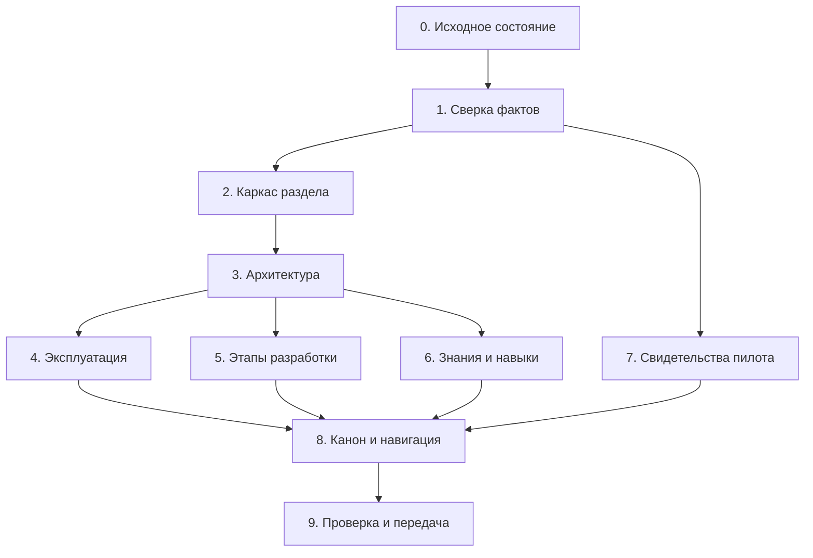

# План переноса знаний о форке Symphony в базу знаний EmotionStat

Дата: **21 сентября 2026 года**. Статус: **перенос документации выполнен по поручению пользователя**.

Целевая база: `D:\work\EmotionStat\knowledge-base`.
Целевой раздел: `70_Engineering/Development/Symphony/`.

Этот документ сохраняет исходный план переноса описаний, решений, инструкций и результатов проверок. После команды пользователя «выполняй» создан раздел, согласованы связанные документы и Action Register, выполнены проверки. Результат — [отчёт о переносе](symphony_knowledge_base_migration_report.md). Установка навыков, настройка runtime и новый rollout остаются отдельной разработкой.

## 1. Главное: почему нужен именно такой перенос

**Рекомендую создать небольшой связанный раздел Symphony и одновременно согласовать его с существующими инженерными документами.** Простое копирование отчёта оставит рядом два противоречащих описания: старое, где автоматизация ещё планируется, и новое, где уже есть реализация и пилот.

База знаний должна объяснять, **почему выбрана архитектура, как пользоваться системой, что подтверждено и что осталось сделать**. Исполняемые настройки и технические инструкции, которые должны изменяться вместе с кодом, продолжают сопровождаться в репозиториях Symphony и agent-runner. В базе будут их назначение, правила применения и ссылки на источники.

Такой вариант решает четыре задачи:

- Сохраняет основания решений, которые иначе останутся только в переписке.
- Разделяет действующие правила, состояние реализации и будущие предложения.
- Позволяет обновлять сведения без переписывания большого отчёта целиком.
- Готовит понятный набор документов для последующей передачи агенту, когда механизм доставки знаний будет реализован.

Сначала переносится знание о системе. Передача базы в контейнер — отдельная разработка: само появление заметок в Obsidian не делает их доступными worker.

### Что остаётся источником истины

| Область | Где сопровождать | Что хранить в новом разделе |
| --- | --- | --- |
| Принятые требования и архитектурные решения | Действующий канон и ADR базы знаний | Обоснование Symphony и ссылки на управляющие документы |
| Фактическое поведение механизма | Код и проверки репозитория Symphony | Проверенное описание с датой и ревизией |
| Профиль проекта, шаблоны, hooks, команды проверки | Репозиторий agent-runner | Назначение, жизненный цикл, правила обновления |
| Код приложения и его CI | Репозиторий приложения | Контракт взаимодействия и ссылки на доказательства |
| Установленная конфигурация | Манифесты и состояние конкретной установки | Способ определения версии и границы проверки |
| Открытые решения и последующие действия | `00_Project Map/Action Register.md` | Ссылки на конкретные ID, пояснения и зависимости |
| История пилотов | Датированные записи и исходные отчёты | Результат, условия, вмешательства, ограничения |

Если реализация расходится с каноном, это фиксируется как расхождение. Наличие кода само по себе не означает, что новое правило уже принято.

## 2. Целевая структура: шесть заметок

```text
70_Engineering/Development/Symphony/
├── Symphony Index.md
├── Architecture and Decisions.md
├── Setup and Operations.md
├── Development Plan.md
├── Skills and Knowledge.md
└── Pilot Results.md
```

| Заметка | На какой вопрос отвечает | Содержание и граница ответственности |
| --- | --- | --- |
| Symphony Index | С чего начать? | Назначение, порядок чтения, краткое состояние, ссылки на пять заметок и действующий канон |
| Architecture and Decisions | Почему форк устроен так? | Исходная Symphony, отличия форка, controller/worker, agent-runner, альтернативы, схемы и границы полномочий |
| Setup and Operations | Как установить, запустить и обслуживать? | Проверенные сценарии Windows/WSL, версии, запуск пилота, диагностика, остановка, обновление и восстановление |
| Development Plan | Что реализовано и что осталось? | Этапы PR01–PR15, этапы installer, доказательства, незакрытые условия, ссылки на Action Register |
| Skills and Knowledge | Что агент знает и как получает доступ? | Текущее положение, проект доставки знаний и навыков, ограничения инструментов и сети, критерии проверки |
| Pilot Results | На чём основана уверенность? | Пилот, коммиты, CI/deployment, ручные проверки, вмешательства, неподтверждённые сценарии |

Не создавать отдельные заметки для каждого вопроса из переписки. Вопросы «зачем agent-runner», «нужно ли менять SHA при каждом коммите» и «можно ли перенести на Linux» входят в соответствующие разделы этих документов.

При первом переносе аналитические материалы получают `active-reference`. `active-canonical` применяется к подтверждённым правилам с явной областью ответственности и без конфликта с действующим каноном. Название папки или документа не делает его каноническим.

Статус заметки в metadata не заменяет состояние реализации. Внутри отдельно указывать: «реализовано», «проверено тестами», «проверено пилотом», «предложено», «требует решения».

## 3. Источники для переноса

Пути в таблице указаны относительно соответствующего репозитория.

| Источник | Что извлечь | Куда перенести |
| --- | --- | --- |
| Symphony: `elixir/docs/symphony_fork_development_report.md` | Обоснование, сравнение с upstream, обзор реализации и ограничений | Architecture, Development Plan, Pilot Results |
| Symphony: `elixir/docs/github_projects_adapter_plan.md` | Требования и основания адаптера | Architecture, Development Plan |
| Symphony: `elixir/docs/github_projects_pr_rollout_plan.md` | Порядок PR01–PR15 и критерии этапов | Development Plan |
| Symphony: `tools/wsl/installer-plan.md`, `tools/wsl/verification.md` | Этапы installer и свидетельства проверок | Development Plan, Setup, Pilot Results |
| Symphony: `runtime/README.md`, `tools/wsl/README.md` | Физическое размещение и эксплуатационные команды | Architecture, Setup |
| Symphony: `elixir/docs/delivery_cycle.md`, `delivery_runtime.md` | Состояние цикла, восстановление, ограничения исполнения | Architecture, Setup |
| Symphony: `elixir/docs/github_projects.md`, `github_projects_publication.md`, `github_projects_delivery.md` | Выбор задачи, публикация, CI и завершение цикла | Architecture, Setup |
| Symphony: `elixir/docs/operator_dashboard.md`, материалы `github_projects_setup/` | Работа оператора и датированные проверки | Setup, Pilot Results |
| agent-runner: README, AGENTS, WORKFLOW.template, profile-lock, hooks, scripts, CI | Реальный контракт профиля и его ограничения | Architecture, Setup, Skills |
| Приложение: AGENTS и workflows CI/deployment | Правила проекта и доказательства результата | Skills, Pilot Results |
| Действующие инженерные заметки базы | Принятые границы и прежние формулировки | Согласование канона и обратные ссылки |
| Переписка | Вопросы, пояснения, предложения | Только после проверки; не самостоятельное доказательство реализации |

Исходный отчёт не переносится целиком во все заметки. Полные технические планы и журналы сохраняются в своих репозиториях; новый раздел содержит осмысленную выжимку и происхождение утверждений.

## 4. Этапы переноса

### Этап 0. Зафиксировать исходное состояние

**Зачем:** сохранить существующую работу и определить, к каким версиям относится описание.

Действия:

1. Перед правками прочитать управляющие документы базы в порядке из её AGENTS: Project Map, Owner Operating Map, Distillation Register, Action Register, Engineering Index.
2. Зафиксировать HEAD и `git status` базы знаний, Symphony, agent-runner и приложения. Локальные изменения учитывать отдельно от коммитов.
3. Отдельно установить версии принятой установки, если эти сведения доступны. Не выводить их из HEAD локального репозитория.
4. Составить рабочий список источников: документ, репозиторий, ревизия, дата, назначение, актуальность.
5. Зафиксировать исходный результат валидатора базы, чтобы после переноса отличать прежние ошибки от новых.

На момент подготовки плана в базе уже изменены `Action Register.md`, `GitHub Cloudflare Deployment Setup Plan.md` и `Agent Development Workflow.md`. При дальнейшем переносе нужно сохранить их содержимое и вносить адресные дополнения поверх него.

**Результат:** исходные версии и изменения известны; выбран точный набор источников.

**Проверка завершения:** ни один существующий изменённый файл не сброшен и не заменён старой копией; установленные версии не смешаны с разработкой.

### Этап 1. Сверить факты, решения и предложения

**Зачем:** не превратить исторический план или предположение в инструкцию к действию.

Для каждого существенного утверждения составить строку:

`Утверждение → источник/ревизия → реализация → проверка → ограничение → целевая заметка`.

Обязательные темы сверки:

| Тема | Что нужно установить |
| --- | --- |
| Исходная Symphony | Сравнивать с указанной базовой ревизией OpenAI, а не приписывать ей возможности сегодняшнего upstream |
| Controller и worker | Какие функции были в базе, какие границы и ограничения добавлены форком |
| Agent-runner | Различать профиль, шаблон workflow, локально сгенерированный workflow, образ и проверку версии при запуске |
| Закрепление версий | Проверить SHA в profile-lock, CI и принятой установке; не считать их автоматически одинаковыми |
| Выполненные этапы | Сопоставить текст планов с кодом и результатами проверок; номер этапа PR не равен номеру GitHub PR |
| Пилот | Отделить прохождение цикла с вмешательствами от полностью автономной работы |
| Завершение задачи | Различать внутреннее состояние цикла, статус карточки, dev validation и production |
| Навыки и Obsidian | Проверить реальную доступность файлов внутри worker; ссылка на KB в AGENTS её не обеспечивает |
| Другие ОС и облако | Отделить возможную адаптацию архитектуры от реализованной и проверенной поддержки |

Предыдущий анализ выявил поводы для повторной проверки: различающиеся Symphony SHA в profile-lock и CI agent-runner; устаревшие описания PR13; незавершённую синхронизацию статуса карточки после merge; отсутствие реализованной доставки KB/навыков. Эти пункты нельзя автоматически объявлять исправленными.

Если для подтверждения нужен новый запуск теста или пилота, записать его как требуемую проверку. Перенос документации сам по себе не требует запуска рабочего агента или изменения инфраструктуры.

**Результат:** проверенная карта фактов и отдельный список расхождений.

**Проверка завершения:** у каждого утверждения «работает» есть основание; у неподтверждённого — видимая оговорка. Конфликт с каноном отмечен, а не скрыт.

### Этап 2. Создать каркас раздела и распределить ответственность

**Зачем:** обеспечить понятный порядок чтения и избежать нескольких документов об одном правиле.

Действия:

1. Создать шесть заметок из целевой структуры.
2. Добавить frontmatter по действующим образцам базы: тип, допустимый статус, владелец, даты и автор обновления; для канона — область ответственности.
3. В начале каждой заметки кратко написать, на какой вопрос она отвечает.
4. Добавить источник, дату сверки и область применимости: разработка, конкретная установка или исторический пилот.
5. Использовать внутренние wikilinks с путём от корня vault. Названия файлов оставить стабильными; заголовки и текст писать по-русски.
6. Для внешнего кода использовать ссылки на соответствующий репозиторий и ревизию. Личные пути Windows оставлять только как примеры окружения.

**Результат:** связанный каркас, готовый к наполнению.

**Проверка завершения:** у каждой темы один основной документ; нет пустых ссылок на ещё несуществующие заметки, притворяющихся готовой документацией.

### Этап 3. Перенести архитектуру и обоснование форка

**Зачем:** сохранить ответ на главный вопрос — почему выбран этот вариант разработки и что оправдывает его сложность.

В `Architecture and Decisions.md` описать:

- Требования EmotionStat: явный допуск задачи, сохранение цикла, изоляция, контроль публикации, проверенный dev перед следующей задачей.
- Исходную Symphony на выбранной ревизии: tracker, orchestrator, workspace, workflow, Codex app-server, повторы и наблюдаемость.
- Добавления форка: Projects v2, постоянное состояние delivery cycle, ограничения исполнения, публикация через controller, изолированный worker.
- Назначение agent-runner: профиль EmotionStat, шаблоны, hooks и проверки; связь с общим механизмом Symphony.
- Распределение ответственности оператора, controller, worker, GitHub и CI/deployment.
- Альтернативы и цену сопровождения: только workflow, отдельный адаптер, внешняя обвязка, собственный runner, выбранный форк.
- Условия пересмотра решения: какие требования сделали сложность необходимой и что можно упростить при изменении этих требований.

Добавить три отдельные Mermaid-схемы:

1. Исходная Symphony на базовой ревизии.
2. Фактическая установка форка на Windows/WSL: границы сред, процессы, данные и credentials.
3. Целевой цикл от допуска задачи до проверенного результата в dev; ещё не реализованные переходы явно пометить.

Будущее размещение controller и worker на отдельных Linux-серверах описать как вариант развития с перечислением зависимостей: транспорт, идентификация, сеть, хранение состояния, сборка образов и эксплуатационные проверки. Не объявлять его готовой функцией только из-за наличия разделения процессов.

**Результат:** понятное объяснение архитектуры с доказуемым разделением «было / сделано / предлагается».

**Проверка завершения:** схемы согласуются с текстом и кодом; не изображают доступ агента к controller credentials или возможность самостоятельно подтвердить ручную validation.

### Этап 4. Описать настройку и эксплуатацию

**Зачем:** дать оператору воспроизводимый маршрут работы, отделив проверенные инструкции от будущих улучшений.

В `Setup and Operations.md` собрать:

1. Предварительные условия и перечень репозиториев/артефактов.
2. Setup, формирование локальной конфигурации и происхождение workflow.
3. Start/Stop, выбор пилота и отдельное разрешение исполнения; сохранить реальные имена команд из исходной документации.
4. Проверку фактически используемых ревизий Symphony, профиля и образа.
5. Жизненный цикл agent-runner: что читается при подготовке, что проверяется при старте, что используется во время задачи.
6. Диагностику по идентификаторам issue/cycle/PR/CI и признакам состояния; ссылки на расположение журналов без копирования их чувствительного содержимого.
7. Остановку, повторный запуск и восстановление: только проверенные сценарии; непроверенные сценарии сна/потери manager отметить отдельно.
8. Процесс обновления: подготовка кандидата, совместимость, тесты, принятие версии, обновление установки и условия отката с учётом состояния.

Особо объяснить: новый коммит Symphony не равен обязательному обновлению установленного комплекта. Автоматическое чтение единственного SHA из profile-lock в CI — предложение до реализации. Не включать вымышленные команды обновления в действующую инструкцию.

**Результат:** инструкция оператора и список эксплуатационных пробелов.

**Проверка завершения:** команды существуют в проверенной версии; ни одна документальная проверка не запускает пилот неявно; ограничения поддержки Windows/Linux/macOS обозначены точно.

### Этап 5. Перенести план разработки и остаток работ

**Зачем:** сохранить логику этапов и показать разницу между написанным кодом, пройденным тестом и принятой поставкой.

В `Development Plan.md` завести две таблицы: PR01–PR15 основного плана и этапы installer. Для каждой строки использовать поля:

| Этап | Для чего | Реализация и ревизия | Что проверено | Ограничения | Что осталось | Action Register ID |
| --- | --- | --- | --- | --- | --- | --- |
| Идентификатор исходного этапа | Требование и обеспечиваемое свойство | Источник фактического изменения | Команда/отчёт, дата, результат | Чего проверка не доказывает | Условие завершения | Существующий или новый ID после регистрации |

Действия:

1. Сверить каждую строку с исходным планом и последующими изменениями.
2. Для перенесённого или объединённого этапа сохранить исходный номер и объяснить новое место выполнения.
3. Не закрывать этап только по наличию merged PR, если его критерии включают установку, восстановление или пилот.
4. Отдельно выделить принятый обязательный остаток и предлагаемые улучшения: навыки, доставка знаний, переносимость, автоматизация обновлений.
5. Сопоставить остаток с Action Register; использовать существующие ID там, где предмет уже покрыт.

В частности, проверить актуальность OPS-002 и ENG-008. Наличие реализации исполнения или постоянного состояния не закрывает автоматически всё содержание этих строк: там есть более широкие условия миграции процесса и наблюдаемости.

**Результат:** обзор прогресса с проверяемыми критериями завершения.

**Проверка завершения:** PR01–PR15 и все этапы installer учтены; у каждого открытого действия есть ID или оно ещё явно находится в рабочей сверке до регистрации. Итоговая заметка не становится вторым независимым трекером.

### Этап 6. Описать знания и навыки агента

**Зачем:** зафиксировать, что агент получает сейчас, и подготовить отдельный реализуемый контракт доставки знаний.

В `Skills and Knowledge.md` сначала описать проверенное текущее состояние, затем проект изменений:

1. Текущие инструкции из репозитория приложения и workflow.
2. Доступность базы знаний и навыков внутри worker: подтвердить проверкой, не наличием файлов на Windows-хосте.
3. Предлагаемый состав знаний: активные архитектурные документы, правила разработки, актуальные решения и навигационная точка входа.
4. Предлагаемый формат: отобранный снимок только для чтения с ревизией источника, перечнем документов и способом проверки версии.
5. Правила отбора и обновления: исключить Legacy, личные настройки и секреты; сохранить зависимости и ссылки между включёнными заметками.
6. Навыки Neon/Cloudflare и другие: отдельно выбрать необходимые навыки, способ поставки, версии и совместимость с закреплённым Codex CLI.
7. Разделить текст навыка и доступ к сервису: навык не устанавливает MCP, не выдаёт credentials и не открывает сеть.
8. Учесть Linux-пути контейнера и действующие сетевые ограничения; не копировать весь пользовательский CODEX_HOME.

Приёмочный сценарий будущей разработки: агент в реальном worker называет ревизию снимка, находит архитектурное правило, ссылается на включённый документ и корректно сообщает об отсутствии недоступных инструментов. Отдельно проверяется отсутствие лишних данных и сохранение ограничений доступа.

**Результат:** ясное описание текущего состояния и отдельный проект подключения знаний/навыков.

**Проверка завершения:** документ не утверждает, что доставка уже работает. Открытые решения имеют ID; установка навыков и сборка образа не входят в перенос документации.

### Этап 7. Перенести результаты пилота и границы доказательств

**Зачем:** сохранить проверяемые свидетельства работоспособности без преувеличения готовности системы.

В `Pilot Results.md` для каждого опыта указать дату, окружение, ревизии, задачу/PR, ожидаемый результат, полученный результат, вмешательства и оставшиеся ограничения.

Первым разобрать уже описанный пилот issue #132 / PR #133: сверить исходные записи о CI, merge, deployment и ручных проверках. Сохранить связь с конкретными SHA, run ID и попытками. Если источники недоступны, указать, что запись перенесена из датированного отчёта, а повторная проверка не выполнена.

Разделить четыре вида подтверждения:

- Проверки отдельных модулей и контрактов.
- Интеграционные тесты.
- Реальное выполнение пилота с описанием вмешательств оператора.
- Приёмку устанавливаемого комплекта на чистой установке и при обновлении.

Отдельно отметить: deployment green не равен работоспособности приложения; внутренний completed не доказывает полную синхронизацию статусов Projects; один пилот не доказывает восстановление после всех сбоев.

**Результат:** датированный журнал доказательств с ограничениями.

**Проверка завершения:** исторические тесты не представлены как выполненные при переносе; открытые проверки зарегистрированы; чувствительные данные из журналов не скопированы.

### Этап 8. Согласовать действующий канон, навигацию и открытые действия

**Зачем:** встроить раздел в базу и убрать противоречия в документах, которые агент или человек читает первыми.

| Существующий документ | Требуемая сверка или изменение |
| --- | --- |
| Engineering Index | Добавить вход в Symphony и обозначить роль новых заметок |
| Agent-Native GitHub and Cloudflare Concept | Уточнить общий механизм Symphony и проектный профиль agent-runner; отделить прежнее «планируется» от текущей реализации |
| MVP Agent Development Architecture | Согласовать границы компонентов и ссылку на архитектуру форка |
| Agent Development Workflow | Отразить фактический цикл и роль оператора, сохранив существующие изменения |
| Agent PR Policy | Проверить соответствие публикации и ручного review; менять только при реальном расхождении |
| GitHub Cloudflare Deployment Flow | Согласовать merge, deployment, validation и границу production |
| GitHub Cloudflare Deployment Setup Plan | Обновить относящиеся к Symphony этапы и ссылки, сохранив существующие изменения |
| Action Register | Уточнить OPS-002/ENG-008, зарегистрировать действительно новые действия и не создавать дубли |
| Open Decisions and Actions | Обновить ссылки при необходимости; сохранить роль указателя на Action Register |
| Distillation Register | Зафиксировать извлечённые источники и результат в принятом формате реестра |
| Project Map / Owner Operating Map | Добавить маршрут только если он нужен пользователю этих карт; не дублировать подробный индекс |

Новые ID назначать после проверки реального реестра. Не придумывать номера заранее и не переносить автоматически весь Action Register в GitHub Issues.

Внутренние открытые вопросы новых заметок связывать с конкретными ID. Подтверждённые решения включать в канон; спорные варианты оставлять явно обозначенными предложениями. При смысловых изменениях канонических заметок обновить `updated` и `updated_by`.

**Результат:** единый маршрут чтения и согласованные правила.

**Проверка завершения:** старые входные документы не описывают реализованную функцию исключительно как будущее намерение; открытые вопросы не потеряны; unrelated-правки сохранены.

### Этап 9. Проверить перенос и передать результат

**Зачем:** убедиться, что раздел пригоден для чтения и не повреждает структуру базы.

Из корня базы выполнить предусмотренные её AGENTS проверки:

```text
python3 tools/validate-vault.py
git ls-files knowledge-base .obsidian
git diff --check
git status --short --branch
```

Если Python в окружении называется иначе, использовать доступный интерпретатор Python 3 и зафиксировать фактическую команду. Проверять и новые файлы: до добавления в Git они не входят в обычный `git diff`.

Дополнительная проверка содержания:

1. Все шесть заметок имеют корректный frontmatter и допустимый статус.
2. Внутренние ссылки разрешаются; источники ведут к нужным документам/ревизиям.
3. Mermaid-схемы и таблицы читаются в Obsidian; текстовая проверка синтаксиса не выдаётся за визуальный просмотр.
4. Для текущего состояния, пилота и предложений используются разные формулировки.
5. Открытые вопросы связаны с Action Register; отсутствуют противоречащие ему списки статусов.
6. Нет копий секретов, Legacy-данных или машинных путей, поданных как универсальная конфигурация.
7. Итоговый diff включает только согласованный объём переноса и сохраняет прежние пользовательские изменения.

**Результат:** готовый раздел и короткий отчёт: созданные/изменённые заметки, исходные ревизии, результаты проверок, ограничения и связанные ID.

**Проверка завершения:** новые ошибки устранены; старые отдельно перечислены. Непроведённые проверки явно указаны. Коммит и публикация выполняются отдельным действием, если запрошены.

## 5. Порядок выполнения и границы пакетов



Работу удобно готовить тремя обозримыми пакетами:

| Пакет | Состав | Что можно оценить |
| --- | --- | --- |
| 1. Основания | Этапы 0–3 | Источники, границы нового раздела, обоснование и архитектура |
| 2. Практика и доказательства | Этапы 4–7 | Эксплуатация, прогресс разработки, навыки и результаты пилота |
| 3. Встраивание | Этапы 8–9 | Согласованный канон, реестр действий, ссылки и проверки |

Это границы подготовки и просмотра изменений, а не обязательные остановки после каждого пакета. Перенос считается законченным только после согласования действующих документов и итоговой проверки.

## 6. Как сопровождать раздел после переноса

| Событие | Что обновлять |
| --- | --- |
| Изменились архитектура, права или границы компонентов | Architecture and Decisions и связанные управляющие документы |
| Изменились setup/start/update или принята новая версия комплекта | Setup and Operations, сведения о проверенной версии |
| Закрыт этап или появилась новая обязательная работа | Development Plan и соответствующая запись Action Register |
| Выполнен пилот, восстановление или приёмка установки | Новая датированная запись Pilot Results |
| Изменился набор знаний/навыков или способ доставки | Skills and Knowledge и источник соответствующей конфигурации |

Не каждый коммит требует обновления базы: обновлять её нужно, когда меняются описанные правила, поведение, ограничения или доказательства. Старые результаты проверок сохранять с их ревизиями, а не переписывать как будто они относятся к новому коду.

Владельцем актуальности раздела назначить роль engineering; решения о процессе и принятых ограничениях остаются у владельца проекта согласно правилам базы. Конкретное назначение владельца оформить при переносе.

## 7. Общий критерий готовности

Перенос завершён, когда читатель, начиная с Engineering Index, может найти ответы на вопросы:

- Почему выбран форк и чем оправдана его сложность?
- Что было в исходной Symphony и что добавлено здесь?
- Для чего нужны controller, worker и agent-runner?
- Как определить используемые версии и безопасно подготовить обновление?
- Что действительно проверено, на каких версиях и при каких ограничениях?
- Какие этапы ещё открыты и где ими управляют?
- Какие знания и навыки агент получает сейчас, а какие только предлагается подключить?

**При этом перенос документации не должен выдавать за выполненную разработку доставку навыков, облачный запуск, автоматизацию обновлений или полную приёмку устанавливаемого комплекта.**
